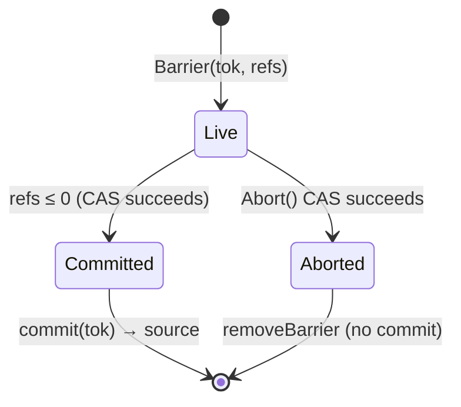
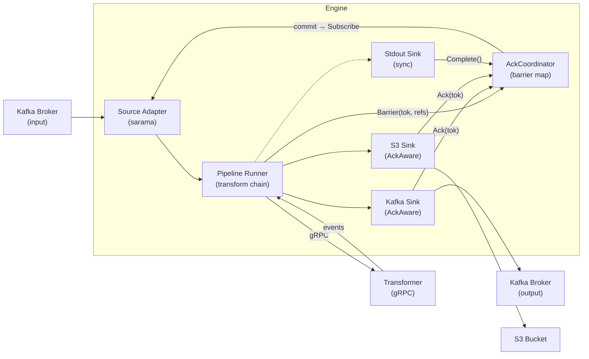
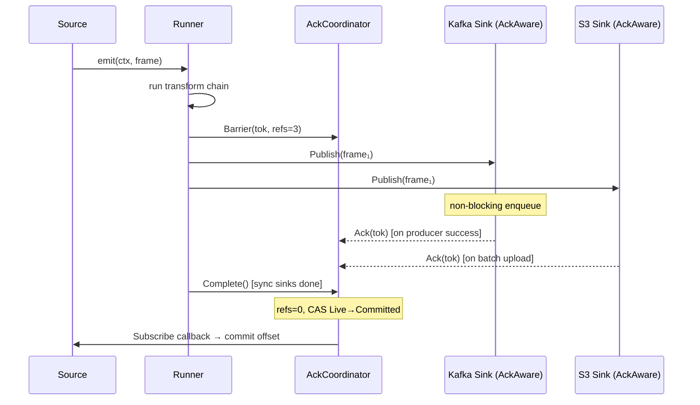
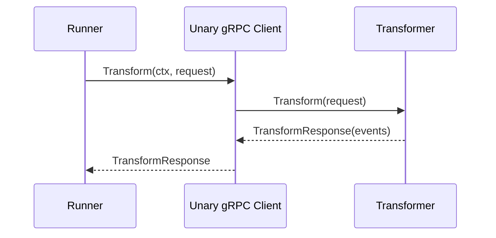
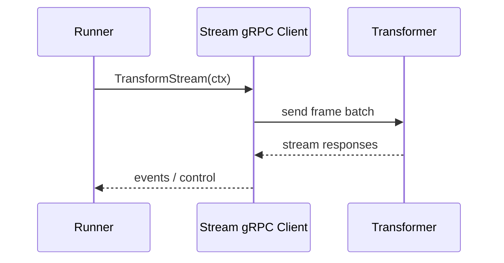
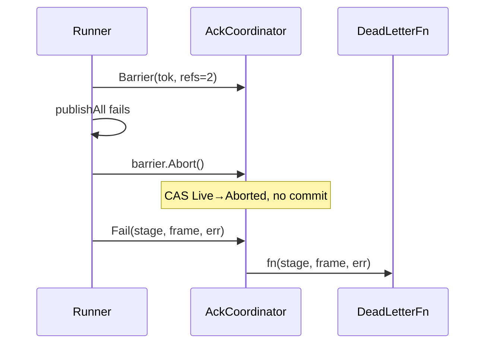

# Architecture

## Engine Lifecycle

1. **Build** – Configuration is parsed, adapter registrations are resolved, and each source/sink is configured with the root `context.Context`. The `AckCoordinator` is created and wired into the `Runner`. No goroutines are launched at this stage.
2. **Start** – `Runner.Start(ctx)` starts the source. Frames emitted by the source run through the transformer chain and into sinks. `AckAware` sinks (Kafka, S3) publish asynchronously and call back through the coordinator when delivery is confirmed.
3. **Stop** – Cancellation of the root context shuts down the pipeline. Sinks receive `Close(ctx)` first, followed by transformers, then the source. The transport server drains outstanding RPCs while the runner exits. Outstanding barriers are abandoned (no commit).

## Context Propagation

- The source supplies a context for each emitted frame. Transformers and sinks _must_ honour deadlines and cancellations on that context.
- Retries wrap the frame context with `context.WithTimeout`, ensuring cancellation cascades downstream.
- Shutdown is graceful: once the root context is cancelled, blocking operations unblock and return errors.

## Backpressure Semantics

- Source drivers use bounded semaphores (`Controller`) to cap in-flight frames. If the pipeline stalls, sources block before `emit`.
- `AckAware` sinks (Kafka, S3) publish non-blocking; backpressure propagates through the coordinator's outstanding barrier count.
- Synchronous sinks (stdout) complete inline — the barrier receives its `Complete()` call immediately after `Publish` returns.

## Delivery Guarantees

- Default behaviour: **at-least-once** delivery. Frames are retried until sinks confirm success.
- **At-most-once** is not provided; offsets are never committed before processing completes.
- **Exactly-once** is not guaranteed. Users can approach it with idempotent sinks and E2E mode.
- **E2E Mode** defers offset commits until **all** sinks acknowledge via the `AckCoordinator` barrier, ensuring upstream brokers are only advanced after complete success.

## AckCoordinator

The `AckCoordinator` is the **sole commit authority** in the pipeline. No component ever commits a checkpoint directly — all commits flow through the coordinator.

### Design

Inspired by the Linux kernel's `kref` refcounting pattern and Kafka's group-coordinator protocol:

- **Barrier** — a refcounted completion token created per source frame. The reference count equals `len(derivedFrames) × ackAwareSinks + 1` (the `+1` accounts for synchronous sinks).
- **Tri-state CAS** — each barrier transitions through exactly one of three terminal states: `Live → Committed` or `Live → Aborted`. A single `CompareAndSwap` arbitrates the race between `release()` and `Abort()`.
- **Pointer-safe removal** — `removeBarrier` compares the map entry's pointer identity before deleting, preventing a successor barrier from being accidentally clobbered by its predecessor's cleanup.

### Barrier State Machine

### Data Flow

### Coordinator Sequence

### Transformer RPC Modes

### Error & Abort Flow

