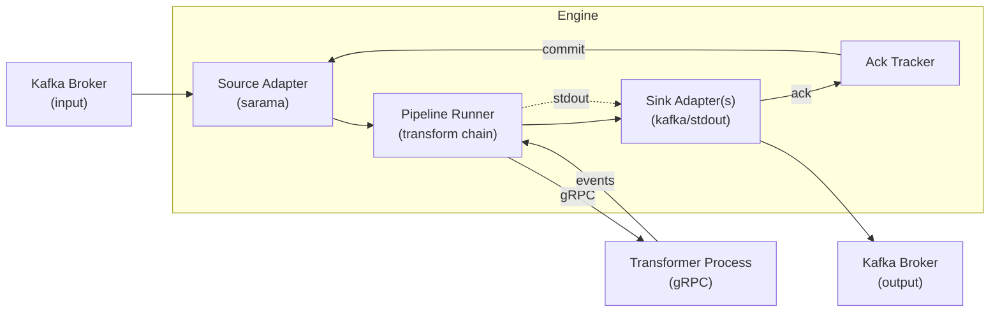
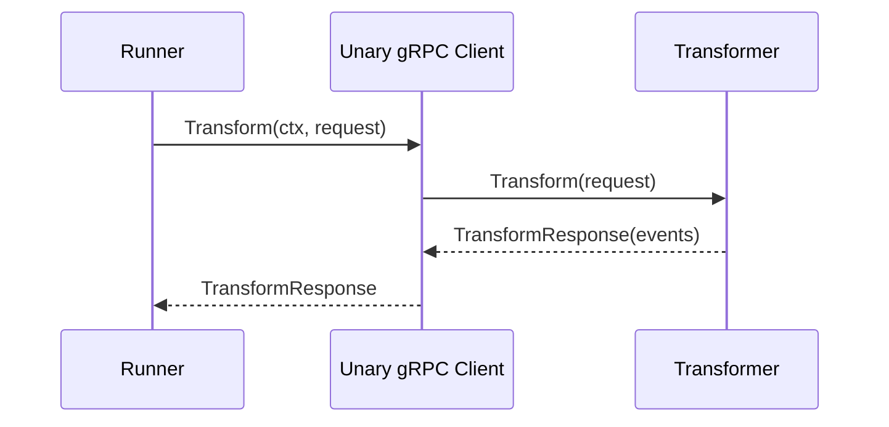
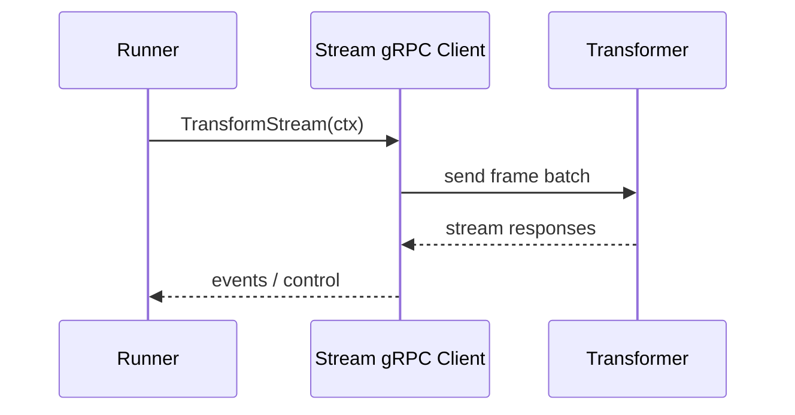
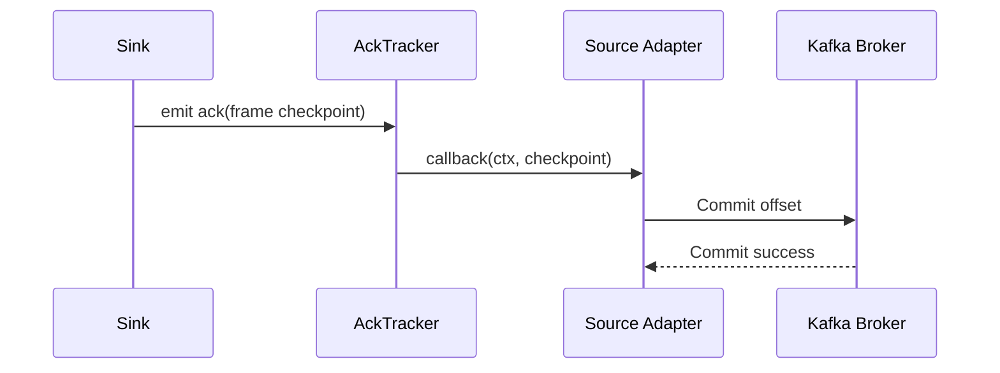

# Architecture

## Engine Lifecycle

1. **Build** – Configuration is parsed, adapter registrations are resolved, and each source/sink is configured with the root `context.Context`. No goroutines are launched at this stage.
2. **Start** – `Runner.Start(ctx)` starts the source. Frames emitted by the source run through the transformer chain and into sinks synchronously using the same lineage context.
3. **Stop** – Cancellation of the root context shuts down the pipeline. Sinks receive `Close(ctx)` first, followed by transformers, then the source. The transport server drains outstanding RPCs while the runner exits.

## Context Propagation

- The source supplies a context for each emitted frame. Transformers and sinks *must* honour deadlines and cancellations on that context.
- Retries wrap the frame context with `context.WithTimeout`, ensuring cancellation cascades downstream.
- Shutdown is graceful: once the root context is cancelled, blocking operations unblock and return errors.

## Backpressure Semantics

- Source drivers use bounded semaphores (`Controller`) to cap in-flight frames. If the pipeline stalls, sources block before `emit`.
- Sinks publish synchronously; if their internal queues saturate they block until space is freed or context is cancelled.
- Ack handling (`ackTracker`) serialises callbacks to guarantee offsets are committed exactly once and never lost when queues overflow.

## Delivery Guarantees

- Default behaviour: **at-least-once** delivery. Frames are retried until sinks confirm success.
- **At-most-once** is not provided; offsets are never committed before processing completes.
- **Exactly-once** is not guaranteed. Users can approach it with idempotent sinks and E2E mode.
- **E2E Mode** defers offset commits until sinks acknowledge, ensuring upstream brokers are only advanced after complete success.

## Flow Overview

### Transformer RPC Modes

### Ack & Commit Loop

