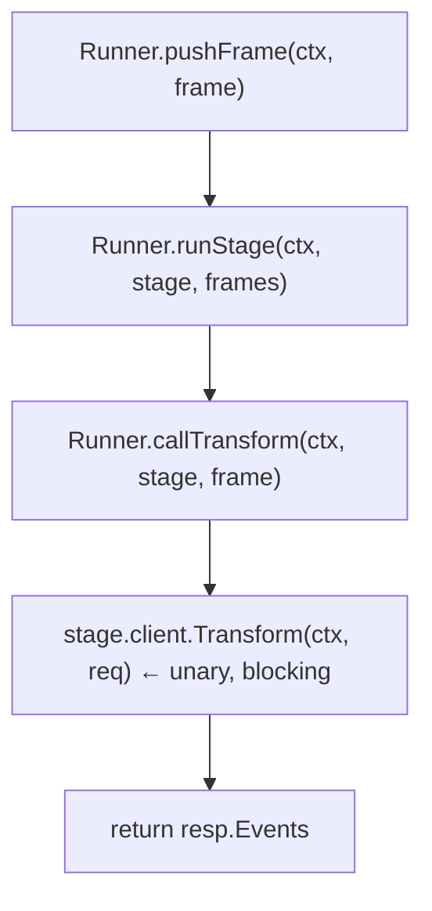
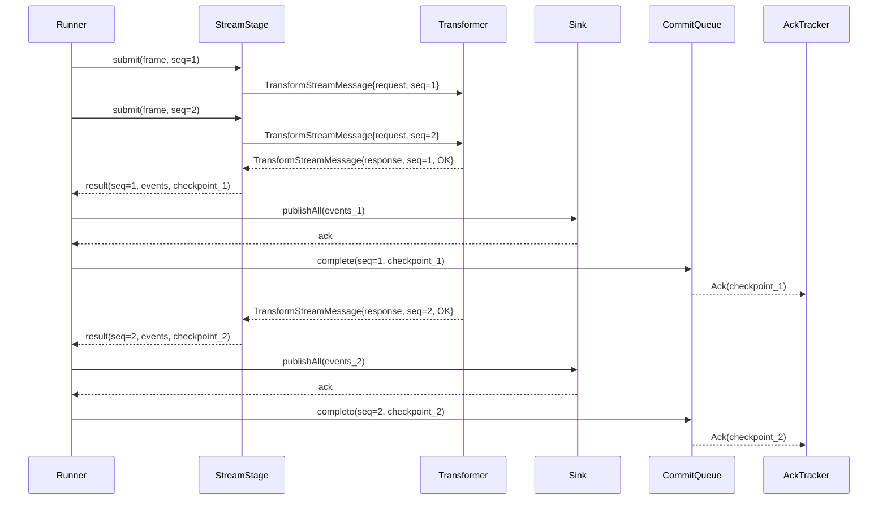
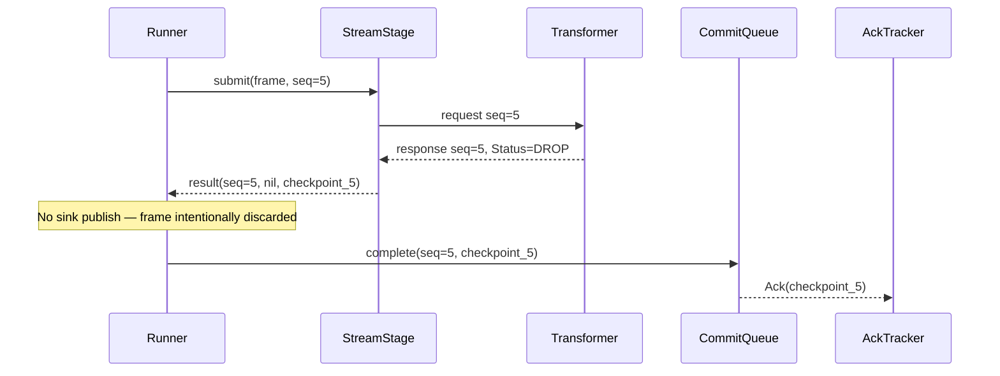
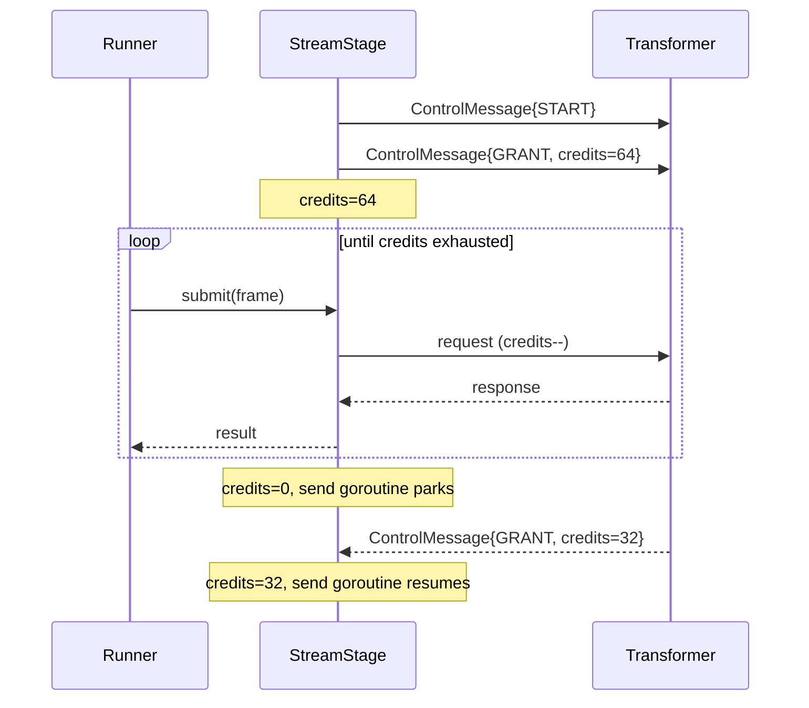
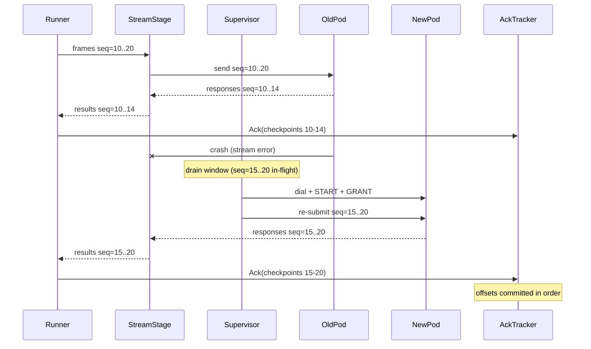
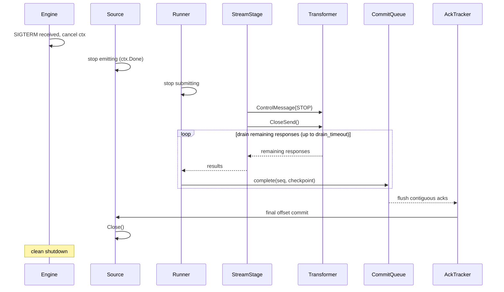
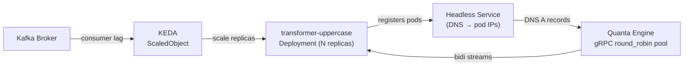
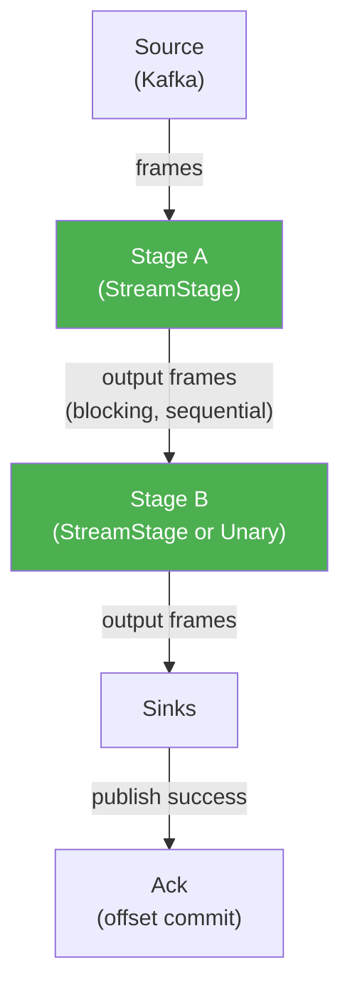

# Bidirectional Streaming Transformers Architecture Design

| Field        | Value                                      |
|--------------|--------------------------------------------|
| Status       | Draft v1                                   |
| Author       | Mohsan Abbas                               |
| Date         | 2026-04-04                                 |
| Target       | Quanta v0.1.0                              |
| Related      | `transformer.proto`, `runner.go`, `grpc_client.go` |

---

## 1. Problem Statement

The current transformer protocol is unary: for every `pb.Frame` the Runner calls `Transform(ctx, TransformRequest)` and blocks until the transformer responds. This is correct and simple, but it has three limitations that become significant at scale:

**Throughput ceiling.** One RPC per frame means the round-trip latency of the transformer directly limits pipeline throughput. With a 5 ms transformer and a 1 ms network, the Runner can push at most ~167 frames/s per goroutine regardless of how many transformer pods are available.

**No pod-level backpressure.** The Runner cannot tell whether a transformer pod is near capacity; it only learns this through timeouts and retries. There is no signal from the transformer back to the Runner saying "slow down."

**Not cloud-native.** Transformer addresses are statically configured. Pod IPs change on rollouts. There is no recipe for independently scaling the transformer fleet or autoscaling based on pipeline pressure.

The protocol already anticipates the solution. `transformer.proto` defines:

```proto
rpc TransformStream(stream TransformStreamMessage) returns (stream TransformStreamMessage);
```

`TransformStreamMessage` is a `oneof` wrapper for requests, responses, and control messages. `ControlMessage` already includes `GRANT`, `PAUSE`, and `RESUME` with a `credits` field. The Go `Client` interface already exposes a `Stream()` method. **The protocol boundary is ready; the engine is not wired up.**

---

## 2. Goals

- Wire the existing `TransformStream` bidi RPC into the Runner as the primary execution path.
- Maintain the existing E2E delivery guarantee: offset commits must survive transformer pod crashes.
- Enable independent horizontal scaling of transformer pods in Kubernetes.
- Implement credit-based flow control using the `GRANT`/`PAUSE`/`RESUME` control messages already defined in the proto.
- Keep the unary `Transform` path available as a fallback for in-process and legacy transformers.

## 3. Non-Goals

- Stateful transformers (windowing, aggregation). This design assumes stateless pure-function transformers throughout.
- mTLS between engine and transformer. Flagged as a follow-up; can be layered via cert-manager or a service mesh without changing this design.
- Fan-out to multiple transformer pods per frame (key-sharded routing). Out of scope for v1; the connection pool in §7 is designed to not foreclose this later.
- Changes to the unary `Transform` RPC. It remains unchanged.

---

## 4. Current Architecture



`GRPCClient.Stream()` exists and correctly calls `c.svc.TransformStream(ctx)`, but `callTransform` never invokes it. `InProcessClient.Stream()` returns `ErrStreamNotSupported`. The stream path is defined at every interface boundary but is entirely unused by the engine.

The unary path has these properties today:

| Property                  | Behaviour                                              |
|---------------------------|--------------------------------------------------------|
| Concurrency               | One in-flight RPC per goroutine; source semaphore caps total |
| Backpressure              | Source blocks before emit; transformer stalls propagate via timeout |
| Recovery on failure       | Retry up to `retryAttempts`; on exhaustion, ack and drop |
| Transformer discovery     | Static address in `pipeline.yml`                       |

### 4.1 Ack timing in the unary path

The current `callTransform` method handles acks differently depending on the outcome:

| Outcome | Who acks | When |
|---------|----------|------|
| `Status_OK` | `pushFrame` | After `publishAll(sinks)` succeeds |
| `Status_DROP` | `callTransform` | Immediately — frame is intentionally discarded, no sink publish |
| `Status_RETRY` / `Status_ERROR` (exhausted) | `callTransform` | Immediately — frame is dropped after max retries |
| Transform RPC error (exhausted) | `callTransform` | Immediately — frame is dropped after max retries |
| All stages pass, 0 output frames | `pushFrame` | Immediately — nothing to publish |

This distinction is critical: **the streaming design must replicate it.** DROP and error-exhaustion ack the checkpoint without sink involvement. Only `Status_OK` flows through to sinks.

### 4.2 Unused config fields

`TransformerConfig` already defines two fields that are parsed but never consumed by the compiler or runner:

- `max_in_flight int` (`yaml:"max_in_flight"`) — intended for window size
- `content_type string` (`yaml:"content_type"`) — intended for payload encoding

The streaming design reuses `max_in_flight` as the in-flight window size rather than introducing a new `window_size` field. This avoids config churn and gives meaning to a field users may already have set.

---

## 5. Protocol Changes

The `TransformStreamMessage` oneof is already the right shape. One field is missing for clean recovery.

### 5.1 Add `seq_id` to request and response

```proto
// TransformRequest — add one field
message TransformRequest {
  string pipeline_id = 1;
  string plugin_id   = 2;
  bytes  payload     = 3;
  EventMetadata metadata = 4;
  bool   batch_mode  = 5;
  uint64 seq_id      = 6;   // NEW: monotonically increasing per-stream counter
}

// TransformResponse — echo it back
message TransformResponse {
  repeated Event events = 1;
  Status status         = 2;
  string error_message  = 3;
  int32  retry_after_ms = 4;
  uint64 seq_id         = 5;   // NEW: echoed from request
}
```

`seq_id` is assigned by the Runner per stream, starting at 0 and incrementing by 1 for each frame sent. The transformer echoes it unchanged. This allows the Runner to receive out-of-order responses and still reconstruct the in-flight window, and to identify exactly which frames were confirmed before a pod crash.

Transformers that do not echo `seq_id` (legacy) return 0, which the Runner interprets as an ordered stream falling back to position-based tracking.

> **Note:** These field numbers (6 on request, 5 on response) are safe — they do not collide with existing fields. Add `// reserved for seq_id` comments to the proto file immediately so no other work accidentally claims them before the streaming implementation lands.

---

## 6. Engine Changes

### 6.1 `StreamStage` — the new execution unit

`StreamStage` replaces `callTransform` for streaming-capable transformer clients. It owns a long-lived bidi stream and exposes a single method to the Runner.

```go
// internal/transform/stream_stage.go

// StreamStage owns a bidi stream to one transformer endpoint.
// It is not safe for concurrent use from multiple goroutines directly;
// the Runner submits frames through Submit and reads results via Results.
type StreamStage struct {
    name    string
    client  Client
    opts    StreamStageOptions

    submit  chan submitEntry    // Runner → send goroutine
    results chan resultEntry    // recv goroutine → Runner
    done    chan struct{}
}

type submitEntry struct {
    frame *pb.Frame
    seqID uint64
}

type resultEntry struct {
    seqID      uint64
    events     []*pb.Event
    status     pb.Status
    checkpoint *pb.CheckpointToken  // extracted from inflight window, not ambient state
    err        error
}

type StreamStageOptions struct {
    Timeout        time.Duration
    RetryAttempts  int
    RetryBackoff   time.Duration
    MaxInFlight    int           // reuses TransformerConfig.max_in_flight
    InitialCredits int32         // sent as GRANT on stream open
}
```

The `StreamStage` runs three goroutines:

**Send goroutine** — reads from `submit`, wraps frames as `TransformStreamMessage{Request: req}`, and writes to the gRPC send stream. Before sending, it checks available credits. If credits are exhausted it parks until a `GRANT` control message is received (see §6.3).

**Recv goroutine** — reads from the gRPC recv stream. Routes messages: `TransformResponse` messages are enriched with the checkpoint token from the in-flight window entry (looked up by `seq_id`) and written to `results`; `ControlMessage` messages (GRANT, PAUSE, RESUME) update the credit counter.

**Supervisor goroutine** — watches for stream errors. On error, it drains the in-flight window, opens a new stream (with exponential backoff), sends an initial `GRANT` to the transformer, and re-submits all in-flight frames in `seq_id` order. This is the crash recovery path. On intentional shutdown (context cancellation), the supervisor does *not* reconnect — see §6.6.

### 6.2 In-flight window and checkpoint mapping

The in-flight window is an ordered map of `seq_id → submitEntry`, bounded by `MaxInFlight`. The Runner may not submit a new frame if the window is full (this provides backpressure back to the source, composing with the existing source semaphore).

```go
// Conceptual — not final API
type inflightWindow struct {
    mu      sync.Mutex
    entries map[uint64]submitEntry
    minSeq  uint64   // lowest unconfirmed seq_id (watermark)
    cap     int
}

func (w *inflightWindow) add(seq uint64, e submitEntry) bool  // false if full
func (w *inflightWindow) confirm(seq uint64) *pb.CheckpointToken  // removes entry, returns checkpoint, advances minSeq if contiguous
func (w *inflightWindow) replay() []submitEntry               // returns entries in seq_id order for re-submission
func (w *inflightWindow) checkpoint(seq uint64) *pb.CheckpointToken  // looks up checkpoint without removing
```

**Checkpoint-to-seqID mapping.** Each `submitEntry` stores the original `*pb.Frame`, which carries `frame.Checkpoint`. When the recv goroutine receives a response for `seq_id=N`, it calls `w.checkpoint(N)` to extract the correct checkpoint token from that specific entry. The checkpoint is **never** taken from ambient state or the most-recently-submitted frame — it is always the checkpoint that was in-flight for that exact `seq_id`.

This mirrors the pattern in `pkg/checkpoint.Uncapped[T]`, where each tracked entry carries its own payload and the watermark only advances on contiguous confirms.

The watermark (`minSeq`) is the highest `seq_id` below which all frames have been confirmed. Offset commits (via `r.Ack`) only fire once a frame's checkpoint leaves the in-flight window. This preserves the E2E invariant.

### 6.3 Credit-based flow control

On stream open, the Runner sends:

```proto
ControlMessage { type: START }
ControlMessage { type: GRANT, credits: <InitialCredits> }
```

The transformer decrements its local credit counter on each received request. When credits reach zero it stops consuming from the stream (gRPC HTTP/2 flow control handles the rest). To resume it sends:

```proto
ControlMessage { type: GRANT, credits: <N> }
```

The Runner's send goroutine maintains a `credits int32` counter (atomic). On `GRANT` it adds the received credits. Before each send it decrements by 1; if it would go negative it blocks until credits are replenished or the stream errors.

`PAUSE` and `RESUME` are used for coarser control: `PAUSE` immediately stops sending regardless of credit count (e.g., transformer is doing a cold-start warm-up); `RESUME` re-enables sending.

### 6.4 Ordered ack / commit queue

Responses may arrive out of order (`seq=5` before `seq=3`), but offset commits to the Kafka source must be monotonically increasing. The `inflightWindow.minSeq` watermark solves this on the transformer side, but the sink-publish → ack path must also be ordered.

The `commitQueue` buffers completed results and only fires `r.Ack(checkpoint)` once all preceding `seq_id`s have been published to sinks:

```go
type commitQueue struct {
    mu        sync.Mutex
    pending   map[uint64]*pb.CheckpointToken  // seq_id → checkpoint (published but waiting for predecessors)
    nextCommit uint64                          // next seq_id eligible to ack
}

func (q *commitQueue) complete(seq uint64, cp *pb.CheckpointToken) []*pb.CheckpointToken {
    // Adds to pending. Returns a slice of checkpoints that can now be acked
    // (contiguous run starting from nextCommit).
}
```

This is directly analogous to the `CheckpointManager.Ack()` in `source/kafka/checkpoint_manager.go`, which advances its watermark only on contiguous offset confirms. The `commitQueue` is the transform-side equivalent.

**DROP and error handling in the commit queue.** When a response has `Status_DROP` or an exhausted error, the commit queue marks the `seq_id` as complete (with its checkpoint) without calling `publishAll`. This replicates the unary path where `callTransform` acks immediately on DROP/error-exhaustion. The frame is discarded, its checkpoint enters the commit queue, and the watermark advances normally.

### 6.5 Runner integration

`Runner.runStage` gains a type switch:

```go
func (r *Runner) runStage(ctx context.Context, st transformStage, in []*pb.Frame) []*pb.Frame {
    if st.stream != nil {
        return r.runStreamStage(ctx, st, in)
    }
    // existing unary path unchanged
    out := make([]*pb.Frame, 0, len(in))
    for _, f := range in {
        events := r.callTransform(ctx, st, f)
        if events != nil {
            out = append(out, toFrames(f, events)...)
        }
    }
    return out
}
```

`runStreamStage` submits frames to the `StreamStage.submit` channel and collects responses from `StreamStage.results`. It handles the bounded window: if the window is full it blocks (propagating backpressure). Results are processed through the `commitQueue`:

1. `Status_OK` → `publishAll(sinks)` → `commitQueue.complete(seq, checkpoint)`
2. `Status_DROP` → `commitQueue.complete(seq, checkpoint)` (no sink publish)
3. `Status_RETRY` / `Status_ERROR` → retry up to max attempts; on exhaustion → `commitQueue.complete(seq, checkpoint)` (drop)
4. For each contiguous run returned by `commitQueue.complete`, call `r.Ack(checkpoint)`

### 6.6 Shutdown sequence

Every goroutine must have a clear shutdown path via `context.Context` (per project conventions). The shutdown sequence when the engine receives SIGTERM:

```
1. Source stops emitting new frames (ctx canceled)
     │
2. Runner stops submitting to StreamStage.submit
     │
3. Send goroutine: detects ctx.Done(), sends ControlMessage{STOP}, calls stream.CloseSend()
     │
4. Recv goroutine: reads remaining responses until EOF, writes to results, closes results channel
     │
5. Supervisor: detects both goroutines stopped, does NOT reconnect (ctx is canceled)
     │
6. Runner: drains results channel, publishes remaining events to sinks
     │
7. commitQueue: flushes all contiguous acks → r.Ack(checkpoint)
     │
8. Source: final offset commit on close
     │
9. StreamStage.done closed — Runner.Stop() returns
```

The critical invariant: in-flight frames at shutdown are either fully processed (response received → published → acked) or abandoned (no ack → source will re-deliver on restart). There is no partial state.

A configurable `drain_timeout` (default 30s) bounds step 4. If the transformer does not respond within this window, remaining in-flight frames are abandoned without ack.

### 6.7 Multi-stage streaming pipelines

The Runner supports a chain of stages: `for _, st := range r.stages`. In the unary path, each stage processes all frames synchronously before the next stage begins.

With streaming, the same sequential model applies at the stage level:

```
Stage A (streaming) processes all frames → collects output frames
  └─ Stage B (streaming or unary) processes the output frames → collects output
       └─ publishAll(sinks) → ack
```

`runStreamStage` is a blocking call that submits all input frames, collects all results, and returns output frames — just like the unary `runStage`. The async nature is internal to the `StreamStage`; the Runner sees a synchronous batch boundary between stages.

**Implication:** The in-flight window and commit queue are per-stage, not per-pipeline. Stage B's commit queue is independent of Stage A's. Acks are only fired after *all* stages complete and sinks publish. This means the ack path is:

```
Stage A confirms (returns frames) → Stage B confirms (returns frames) → publishAll → Ack
```

If Stage A is streaming and Stage B is unary (or vice versa), the type switch in `runStage` handles it transparently.

> **Future optimization:** True pipelined stages (Stage A feeds Stage B as results arrive, without waiting for all of Stage A to complete) would require a DAG-based runner. This is explicitly deferred — the current sequential model is correct and the in-flight window already provides concurrency within a single stage.

---

## 7. Connection Pool for Kubernetes

### 7.1 Problem with a static single target

`NewGRPCClient` today dials a single static address. Under Kubernetes, a `ClusterIP` Service load-balances at the TCP connection level, not the HTTP/2 stream level — meaning all gRPC calls from one `ClientConn` land on the same pod.

### 7.2 Headless Service + DNS round-robin

The recommended approach uses a Kubernetes headless Service (no ClusterIP) and gRPC's built-in `round_robin` balancer. The headless Service causes the DNS resolver to return all pod IPs. gRPC's `round_robin` balancer opens one subchannel per address and distributes streams across them.

```go
// internal/transform/pool.go

func NewStreamingPool(ctx context.Context, target string, opts StreamPoolOptions) (*GRPCClient, error) {
    // NOTE: Do not pass grpc.WithTransportCredentials here.
    // NewGRPCClient already adds insecure credentials internally.
    // Passing it again would conflict. If mTLS is needed later,
    // refactor NewGRPCClient to accept credentials as a parameter.
    return NewGRPCClient(ctx,
        "dns:///"+target,   // e.g. "dns:///transformer-uppercase.default.svc.cluster.local:50052"
        grpc.WithDefaultServiceConfig(`{"loadBalancingConfig": [{"round_robin": {}}]}`),
    )
}
```

gRPC's resolver polls the DNS record at configurable intervals (default 30 s). When transformer pods are added or removed, the balancer adds or removes subchannels accordingly. No custom endpoint watching is required.

### 7.3 Multiple streams per connection

A single `ClientConn` with `round_robin` opens multiple HTTP/2 connections (one per pod subchannel). Each `StreamStage` opens one bidi stream. For higher parallelism, the `transformStage` can hold a slice of `StreamStage` instances and distribute frames across them using a simple modulo on the frame key — effectively key-affine routing without external state.

---

## 8. Delivery Guarantee Under Pod Crashes

The E2E invariant is: *an offset is committed to the upstream broker only after the corresponding frame has been acknowledged by all sinks.*

With bidirectional streaming this invariant is preserved as follows:

```
Frame enters inflightWindow (minSeq advances only on contiguous confirms)
  │
  ▼
Sent to transformer over bidi stream
  │
  ├── Happy path (Status_OK):
  │     response received → seq_id confirmed → frame exits window
  │     └─ publishAll(sinks) → commitQueue.complete(seq) → Ack(checkpoint)
  │
  ├── DROP / error-exhaustion:
  │     response received with DROP or retries exhausted
  │     └─ commitQueue.complete(seq) → Ack(checkpoint)   [no sink publish]
  │
  └── Pod crash: stream errors out
        └─ Supervisor: drain window, reconnect, re-submit all in-flight frames
              └─ Frames re-processed by new pod (stateless: safe)
                    └─ Responses received → normal path (OK / DROP / error)
```

Because transformers are stateless, re-submitting an in-flight frame to a different pod produces the same output. Sink idempotency (already required by E2E mode) absorbs any duplicate publishes that result from re-processing frames whose responses were already received before the crash.

**The ackTracker / sliding window checkpoint in the Kafka source does not change.** The `inflightWindow` in the `StreamStage` and the `commitQueue` in the Runner are separate, upstream gates that delay the call to `r.Ack(checkpoint)` until after processing completes — composing with, not replacing, the existing ack mechanism.

---

## 9. Cloud-Native Recipes

### 9.1 Transformer Deployment

```yaml
# deploy/k8s/transformer-deployment.yaml
apiVersion: apps/v1
kind: Deployment
metadata:
  name: quanta-transformer-uppercase
  labels:
    app: quanta-transformer
    transformer: uppercase
spec:
  replicas: 3
  selector:
    matchLabels:
      app: quanta-transformer
      transformer: uppercase
  template:
    metadata:
      labels:
        app: quanta-transformer
        transformer: uppercase
    spec:
      containers:
        - name: transformer
          image: your-registry/transformer-uppercase:latest
          ports:
            - containerPort: 50052
              name: grpc
          readinessProbe:
            grpc:
              port: 50052
            initialDelaySeconds: 5
            periodSeconds: 10
          livenessProbe:
            grpc:
              port: 50052
            initialDelaySeconds: 10
            periodSeconds: 30
          resources:
            requests:
              cpu: "250m"
              memory: "128Mi"
            limits:
              cpu: "1000m"
              memory: "512Mi"
```

### 9.2 Headless Service (required for pod-level DNS)

```yaml
# deploy/k8s/transformer-service.yaml
apiVersion: v1
kind: Service
metadata:
  name: quanta-transformer-uppercase
spec:
  clusterIP: None          # headless — DNS returns all pod IPs
  selector:
    app: quanta-transformer
    transformer: uppercase
  ports:
    - port: 50052
      targetPort: 50052
      name: grpc
```

The engine config references this Service:

```yaml
# pipeline.yml
transformers:
  - name: uppercase
    type: grpc
    address: "quanta-transformer-uppercase.default.svc.cluster.local:50052"
    mode: stream          # NEW field: "unary" | "stream"
    max_in_flight: 256    # reuses existing field — now wired as window size
    stream:
      initial_credits: 64
    timeout_ms: 5000
    retry_policy:
      attempts: 3
      backoff_ms: 200
```

### 9.3 KEDA Autoscaler

KEDA scales transformer pods based on Kafka consumer group lag — the most direct signal of pipeline pressure.

```yaml
# deploy/k8s/transformer-scaler.yaml
apiVersion: keda.sh/v1alpha1
kind: ScaledObject
metadata:
  name: quanta-transformer-uppercase-scaler
spec:
  scaleTargetRef:
    name: quanta-transformer-uppercase
  minReplicaCount: 1
  maxReplicaCount: 20
  cooldownPeriod: 60
  triggers:
    - type: kafka
      metadata:
        bootstrapServers: kafka.default.svc.cluster.local:9092
        consumerGroup: quanta-consumer
        topic: input-topic
        lagThreshold: "100"         # scale up when lag > 100 messages per replica
        offsetResetPolicy: latest
```

With `lagThreshold: "100"` and 3 replicas, KEDA will add a replica when lag exceeds 300. At `maxReplicaCount: 20`, the transformer fleet can absorb 2000 messages of lag before hitting the ceiling.

### 9.4 Engine Deployment (reference)

The engine itself does not scale horizontally in this design (one Kafka consumer group member per pipeline instance). It runs as a single-replica Deployment or, for partition-level parallelism, one replica per Kafka partition subset:

```yaml
# deploy/k8s/engine-deployment.yaml
apiVersion: apps/v1
kind: Deployment
metadata:
  name: quanta-engine
spec:
  replicas: 1
  template:
    spec:
      containers:
        - name: engine
          image: your-registry/quanta-engine:latest
          env:
            - name: QUANTA_SOURCE__BROKERS
              value: "kafka.default.svc.cluster.local:9092"
            - name: QUANTA_TUNING__INFLIGHT_MSGS
              value: "4096"
          volumeMounts:
            - name: config
              mountPath: /etc/quanta
      volumes:
        - name: config
          configMap:
            name: quanta-pipeline-config
```

---

## 10. Migration Path

The unary and streaming paths are parallel and selected by the `mode` field in `pipeline.yml`. No existing deployments break.

| Phase | Action | Risk |
|-------|--------|------|
| 1 — Proto | Add `seq_id` to `TransformRequest` / `TransformResponse` | None — additive, backward compatible |
| 2 — Engine | Implement `StreamStage`, `inflightWindow`, `commitQueue`; add `mode: stream` config toggle; wire `max_in_flight` | Medium — new code paths, needs integration tests |
| 3 — Transformer SDK | Add `seq_id` echo to example transformers; document the streaming contract | Low |
| 4 — K8s | Deploy headless Service + KEDA ScaledObject; update `pipeline.yml` address | Low — infra only |
| 5 — Cutover | Switch `mode: stream` in production; monitor watermark lag and credit metrics | Low — unary fallback available |

---

## 11. Observability

The following metrics should be emitted by `StreamStage` via the existing `internal/telemetry` package and exposed on the `/metrics` endpoint. Per project conventions, metrics are defined in the telemetry package — not embedded as counters in domain structs.

| Metric | Type | Description |
|--------|------|-------------|
| `quanta_stream_inflight_frames` | Gauge | Current in-flight frames per stream stage |
| `quanta_stream_credits_available` | Gauge | Current credit balance per stream |
| `quanta_stream_reconnects_total` | Counter | Number of stream reconnections (supervisor restarts) |
| `quanta_stream_replay_frames_total` | Counter | Frames re-submitted after a pod crash |
| `quanta_stream_response_latency_seconds` | Histogram | Time from frame submit to response received |
| `quanta_transformer_pod_count` | Gauge | Active subchannels in the gRPC round-robin pool |
| `quanta_stream_commit_queue_depth` | Gauge | Pending entries in commit queue awaiting contiguous predecessors |
| `quanta_stream_drain_timeout_total` | Counter | Frames abandoned at shutdown due to drain timeout expiry |

---

## 12. Open Questions

| # | Question | Owner | Priority |
|---|----------|-------|----------|
| 1 | `max_in_flight` is per-transformer. Should there be a global cap across all stages to bound total memory? Current source tuning uses a global `inflight_msgs`. | Engine team | High |
| 2 | How does the transformer SDK advertise streaming support? Should `MetadataResponse.capabilities` include a `"streaming": "true"` key so the Runner can auto-select mode? | Protocol | Medium |
| 3 | mTLS for engine ↔ transformer streams in production. cert-manager self-signed CA or service mesh (Istio)? `NewGRPCClient` currently hardcodes insecure credentials — needs refactoring to accept `grpc.DialOption` for TLS. | Infra | Medium |
| 4 | Should `InProcessClient.Stream()` be implemented for integration testing, or should tests use a local gRPC server? A local gRPC server is simpler and tests the real proto surface. | Testing | Low |
| 5 | Multi-pipeline fan-out: if two pipelines share one transformer Deployment, how are credits and windows accounted? Each pipeline has its own stream — credits are per-stream, not per-pod. | Engine team | Low |
| 6 | `content_type` field on `TransformerConfig` is unused. Should streaming mode use protobuf-encoded frames (via `content_type: "application/protobuf"`) instead of raw `Frame.Value` bytes? This affects whether `req.Payload` is the raw value or a marshaled proto. | Protocol | Low |
| 7 | What is the default `drain_timeout` at shutdown? 30s matches Kubernetes `terminationGracePeriodSeconds` default. | Engine team | Low |

---

## Appendix A — Sequence Diagrams

### A.1 Happy Path (bidi streaming)



### A.2 DROP and error-exhaustion path



### A.3 Credit-based flow control



### A.4 Pod crash and recovery



### A.5 Graceful shutdown



### A.6 Kubernetes scaling flow



### A.7 Multi-stage streaming pipeline



> Stages execute sequentially. Stage B does not begin until Stage A has processed all input frames and returned its output. The async in-flight window operates *within* a single stage, not across stages.
