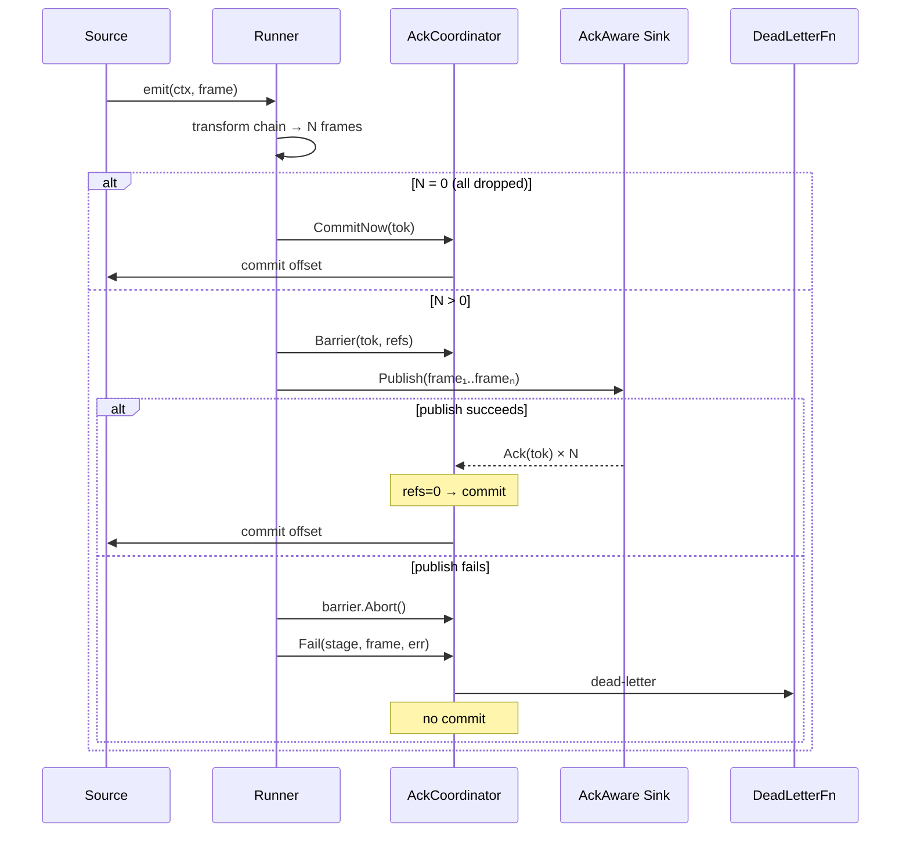
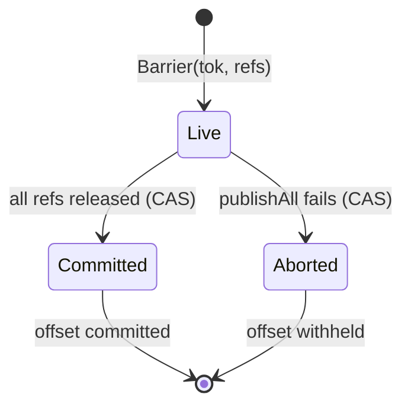

# E2E Offset Commit Semantics

## Commit Authority

The `AckCoordinator` is the **sole commit authority**. No component ever interacts with the source checkpoint directly — all commits flow through coordinator barriers.

## Scenario Matrix

| Scenario                        | Behaviour                                                                                                                                              | Commit?          | Notes                                                                                |
| ------------------------------- | ------------------------------------------------------------------------------------------------------------------------------------------------------ | ---------------- | ------------------------------------------------------------------------------------ |
| Transform OK → All sinks ack    | Barrier refs reach 0, CAS `Live→Committed`                                                                                                             | **Yes**          | Standard happy path.                                                                 |
| Transform returns error         | Runner retries per stage policy. On exhaustion, `Fail()` dead-letters the frame. If all derived frames are dropped, `CommitNow()` advances the offset. | **Conditional**  | Offset advances only when nothing reaches sinks, or when surviving barriers resolve. |
| Plugin routes to DLQ            | Plugin returns `Status_OK` with DLQ envelope. Engine treats as success → sinks publish → ack → commit.                                                 | **Yes**          | Plugin owns DLQ. See [Error Handling — DLQ Ownership](error-handling.md).            |
| Sink publish error              | `barrier.Abort()` prevents commit. Offset withheld; source redelivers.                                                                                 | **No**           | Offset stays; source will redeliver.                                                 |
| AckAware sink confirms delivery | Sink calls `coord.Ack(tok)` → barrier `release()` decrements refs.                                                                                     | **When refs=0**  | Each sink acks independently.                                                        |
| AckAware sink delivery failure  | Pump withholds ack → barrier stays `Live` → offset never committed.                                                                                    | **No**           | Source redelivers on restart.                                                        |
| Transformer DROP                | No derived frames → `CommitNow(tok)` immediately.                                                                                                      | **Yes**          | Treated as successful filter.                                                        |
| Fan-out (N frames × M sinks)    | Barrier created with `refs = N×M + 1`. Each sink ack decrements. Sync sinks call `Complete()`.                                                         | **When all ack** | Single barrier covers entire fan-out.                                                |
| Context cancellation            | Outstanding barriers abandoned, no commit.                                                                                                             | **No**           | Shutdown safety.                                                                     |

## Coordinator Flow

## Barrier Lifecycle

## Duplicate Delivery

If the source redelivers a frame whose barrier is still outstanding, the coordinator force-aborts the stale barrier and creates a fresh one. This prevents resource leaks from abandoned barriers.
