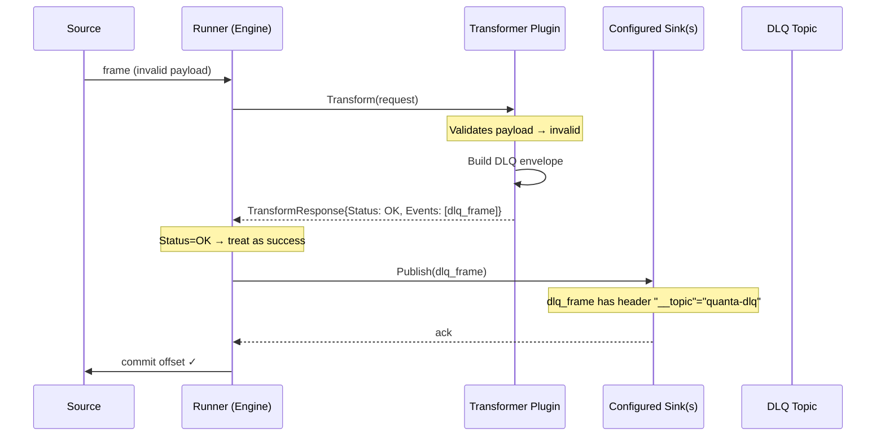
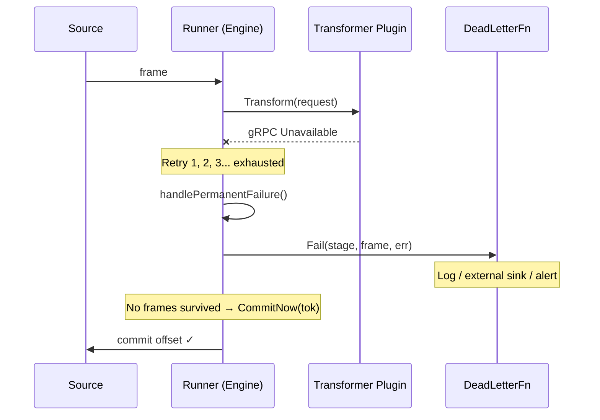
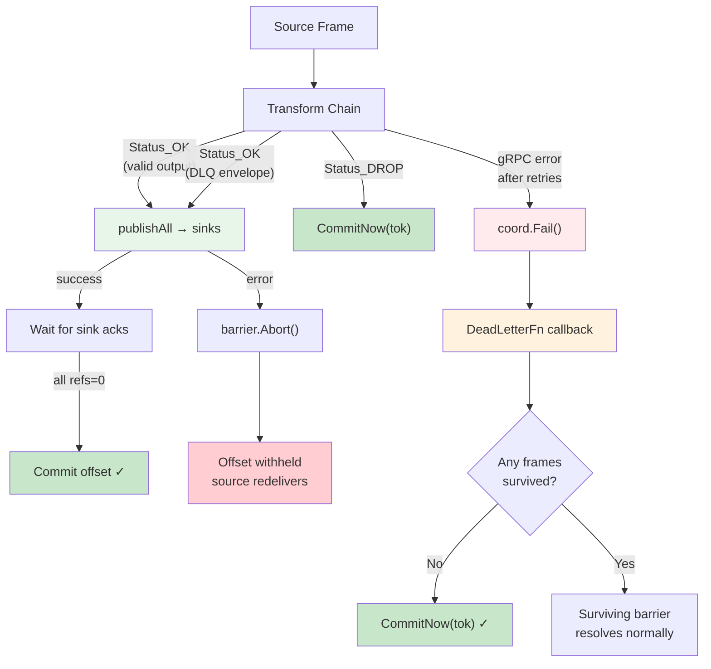
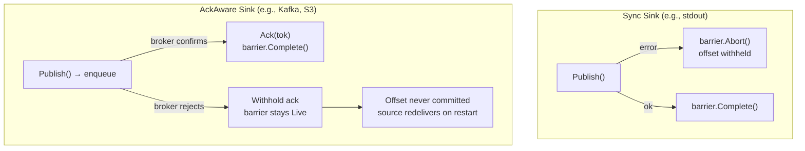

# Error Handling

## Error Classification

| Stage Outcome                     | Commit Offset? | Retry?                       | Dead-Letter?     | Notes                                                                          |
| --------------------------------- | -------------- | ---------------------------- | ---------------- | ------------------------------------------------------------------------------ |
| Transform success → All sinks ack | Yes            | No                           | No               | Barrier refs reach 0 → `Live→Committed`.                                       |
| Transform transient error         | No (pending)   | Yes, bounded by stage config | No               | Retried with backoff. After exhaustion → permanent failure.                    |
| Transform permanent error         | Conditional    | No                           | Yes (engine DLQ) | `Fail()` dead-letters. If no frames survive, `CommitNow()` advances offset.    |
| Sink publish error                | No             | No (barrier aborted)         | No               | `barrier.Abort()` prevents commit. Offset withheld; source redelivers.         |
| AckAware sink delivery failure    | No             | Broker-level                 | No               | Pump withholds ack → barrier stays Live → offset never committed → redelivery. |
| Transformer `DROP`                | Yes            | No                           | No               | No derived frames → `CommitNow()`.                                             |
| Transformer routes to DLQ topic   | Yes            | No                           | Yes (plugin DLQ) | Plugin returns `Status_OK` with DLQ envelope → engine treats as success.       |
| Context cancelled                 | No             | No                           | No               | Outstanding barriers abandoned. Shutdown safety.                               |

---

## DLQ Ownership Model

> **Critical design principle:** Quanta does not own the dead-letter queue.
> The transformer plugin owns DLQ routing decisions. The engine provides a
> last-resort `DeadLetterFn` only for infrastructure failures.

There are **two completely separate DLQ mechanisms** in Quanta, and confusing
them leads to incorrect assumptions about offset commit behaviour.

### 1. Plugin-Owned DLQ (Business Logic)

When a transformer decides a message is invalid — bad schema, missing
fields, rejected status — the plugin itself routes the event to a DLQ topic.
**The engine never sees this as a failure.**



**Key characteristics:**

- The plugin returns `Status_OK` with a DLQ envelope as the output event
- From the engine's perspective, the transform **succeeded** — it got a valid frame back
- The DLQ routing happens via header-based topic override (e.g., `__topic: quanta-dlq`)
- The sink publishes to the DLQ topic, acks, barrier completes, **offset commits**
- The source message is **not redelivered** — it was successfully processed

**Example — CloudEvents transformer:**

```go
// The plugin decides this message is invalid and routes to DLQ
func (s *transformerServer) toDLQ(raw []byte, errClass, errMsg string) *pb.TransformResponse {
    envelope := dlqEnvelope{
        Error:       errMsg,
        ErrorClass:  errClass,
        Transformer: _pluginName,
        RawPayload:  rawPayload,
    }
    payload, _ := json.Marshal(envelope)

    // Route to DLQ via header-based topic override
    headers := map[string]string{
        "dlq-error":       errMsg,
        "__topic":         "quanta-dlq",  // ← sink picks this up
    }

    return &pb.TransformResponse{
        Status: pb.Status_OK,          // ← engine sees SUCCESS
        Events: []*pb.Event{{Value: payload, Metadata: &pb.EventMetadata{Headers: headers}}},
    }
}
```

### 2. Engine-Owned DeadLetterFn (Infrastructure Failures)

When the transform infrastructure itself fails — gRPC timeout, connection
refused, all retries exhausted — the engine invokes `DeadLetterFn` as a
**last resort**. This is not a business decision; it means the plugin was
unreachable.



**Key characteristics:**

- Triggered by `AckCoordinator.Fail(stage, frame, cause)` after retry exhaustion
- `DeadLetterFn` is a callback — the engine does not dictate where the dead letter goes
- The checkpoint decision is made by `pushFrame()`, not by `DeadLetterFn`:
  - If **no frames survived** the transform chain → `CommitNow(tok)` → offset advances
  - If **some frames survived** → barrier covers the survivors → offset commits when sinks ack

```go
type DeadLetterFn func(stage string, frame *pb.Frame, cause error)
```

- Set via `Runner.SetDeadLetter(fn)` → `coord.SetDeadLetter(fn)`
- The handler is free to log, push to an external queue, send an alert — the engine doesn't care
- The handler does **not** control offset commit behaviour

### Comparison

| Aspect               | Plugin-Owned DLQ                               | Engine DeadLetterFn                               |
| -------------------- | ---------------------------------------------- | ------------------------------------------------- |
| **Who decides?**     | Transformer plugin (business logic)            | Engine (infrastructure failure)                   |
| **When triggered?**  | Plugin validates payload and rejects it        | gRPC error / timeout after all retries            |
| **Transform status** | `Status_OK` (success with DLQ frame)           | No response (transport failure)                   |
| **Offset commits?**  | Yes — engine sees it as a successful transform | Conditional — depends on surviving frames         |
| **Redelivery?**      | No — message was processed successfully        | No — engine calls `CommitNow` if nothing survived |
| **DLQ destination**  | Plugin-chosen topic via header routing         | Caller-provided callback (external to engine)     |
| **Sink involved?**   | Yes — DLQ frame flows through configured sinks | No — `DeadLetterFn` is a direct callback          |

### DLQ Flow Diagram (Combined)



> **Rule of thumb:** If the transformer can parse the message and decide it's
> invalid, the transformer should route it to a DLQ topic itself (returning
> `Status_OK`). The engine's `DeadLetterFn` is only for cases where the
> transformer was never reachable in the first place.

---

## Error Flow (Sink Delivery)



## Hooks

- Stage configuration controls retry count and backoff duration per transformer.
- Sink adapters expose retry/backoff knobs (`retry.*`) in their config.
- Metrics: publish attempts/errors, retry totals, barrier commit/abort counts via `AckCoordinator.Len()` observability.
