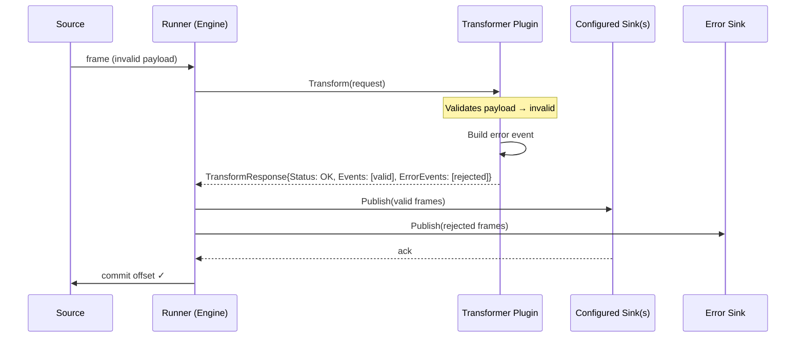
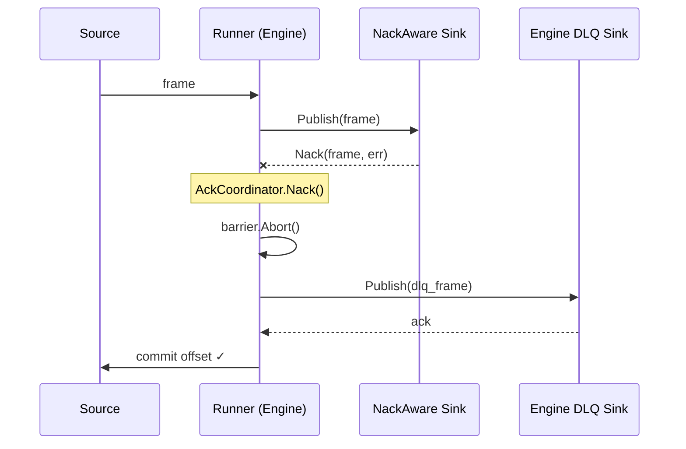
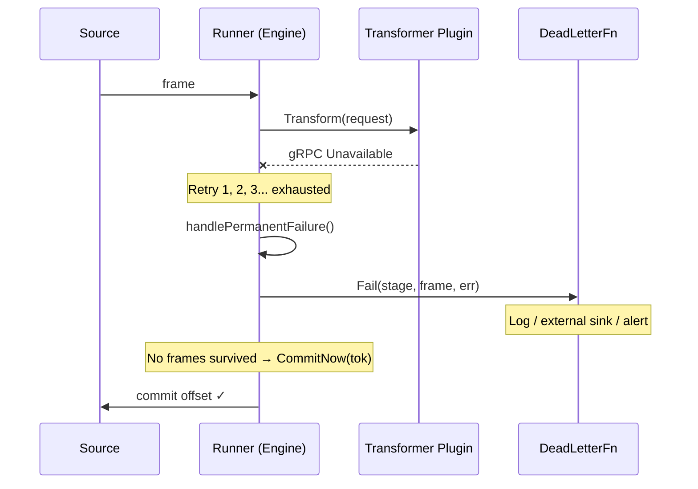
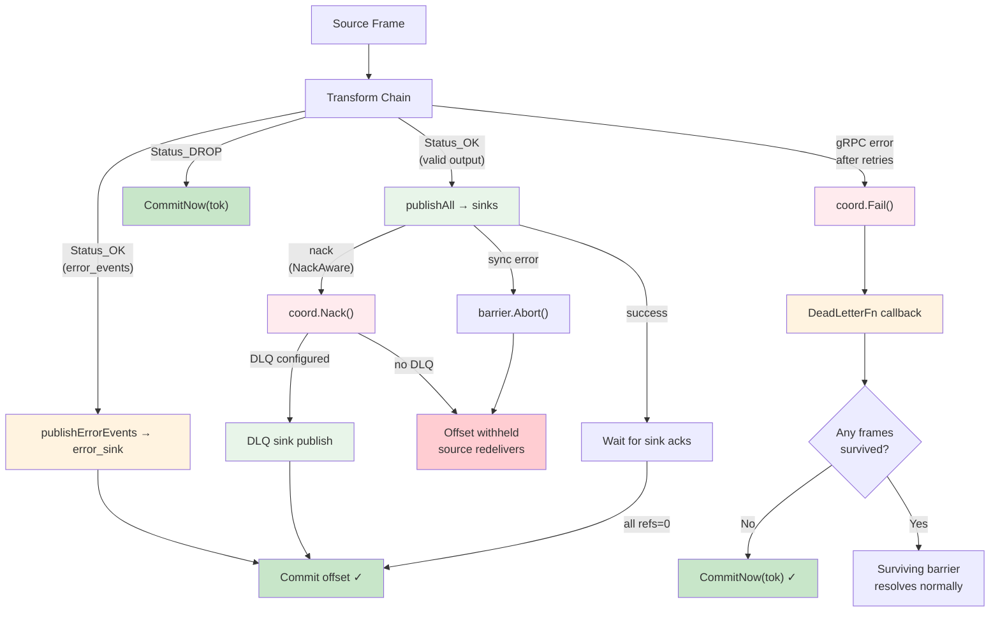
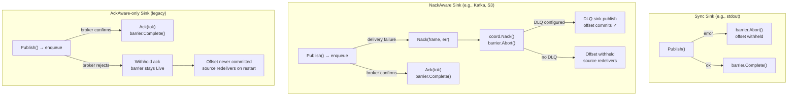

# Error Handling

## Error Classification

| Stage Outcome                     | Commit Offset? | Retry?                       | Dead-Letter?               | Notes                                                                          |
| --------------------------------- | -------------- | ---------------------------- | -------------------------- | ------------------------------------------------------------------------------ |
| Transform success → All sinks ack | Yes            | No                           | No                         | Barrier refs reach 0 → `Live→Committed`.                                       |
| Transform transient error         | No (pending)   | Yes, bounded by stage config | No                         | Retried with backoff. After exhaustion → permanent failure.                    |
| Transform permanent error         | Conditional    | No                           | Yes (engine DLQ sink)      | `Fail()` dead-letters. If no frames survive, `CommitNow()` advances offset.    |
| Sink publish error (sync)         | No             | No (barrier aborted)         | No                         | `barrier.Abort()` prevents commit. Offset withheld; source redelivers.         |
| NackAware sink delivery failure   | Yes            | No                           | Yes (engine DLQ sink)      | Nack → coordinator publishes to DLQ sink → barrier completes → offset commits. |
| AckAware sink delivery failure    | No             | Broker-level                 | No                         | Withhold ack → barrier stays Live → offset never committed → redelivery.       |
| Plugin rejects event              | Yes            | No                           | Yes (per-stage error sink) | Plugin returns `error_events` → engine routes to configured `error_sink`.      |
| Transformer `DROP`                | Yes            | No                           | No                         | No derived frames → `CommitNow()`.                                             |
| Context cancelled                 | No             | No                           | No                         | Outstanding barriers abandoned. Shutdown safety.                               |

---

## Error Ownership Model

> See [Error Ownership](error-ownership.md) for the full three-path design.

There are **three separate error-handling paths** in Quanta, each owned by a
different component. See `docs/specs/error-ownership.md` for the definitive
reference.

### 1. Plugin Error Routing (`error_events` → `error_sink`)

When a transformer decides a message is invalid — bad schema, missing
fields, business rejection — the plugin returns the rejected events in
`TransformResponse.error_events`. The engine routes them to the transformer's
configured `error_sink`.

```yaml
transformers:
  - name: cloudevents
    type: grpc
    address: localhost:50052
    error_sink:
      sink: kafka
      config:
        topic: quanta-error-events
        brokers: ["localhost:9092"]
```



**Key characteristics:**

- Plugin returns `Status_OK` with valid events in `events` and rejected events in `error_events`
- Engine routes `error_events` to the per-stage `error_sink` (configured in pipeline YAML)
- From the engine's perspective, the transform **succeeded**
- **Offset commits** — the message was successfully processed
- If no `error_sink` is configured, error events are logged and dropped

**Example — CloudEvents transformer:**

```go
func (s *transformerServer) Transform(ctx context.Context, req *pb.TransformRequest) (*pb.TransformResponse, error) {
    ce, err := toCloudEvent(req.Frame.Value)
    if err != nil {
        // Return as error_event — engine routes to error_sink
        return toErrorEvent(req.Frame.Value, "parse_error", err.Error()), nil
    }
    return toSuccess(ce), nil
}

func toErrorEvent(raw []byte, errClass, errMsg string) *pb.TransformResponse {
    envelope, _ := json.Marshal(errorEnvelope{Error: errMsg, ...})
    return &pb.TransformResponse{
        Status: pb.Status_OK,
        ErrorEvents: []*pb.Event{{Value: envelope}},
    }
}
```

### 2. Engine DLQ Sink (Sink Delivery Failures)

When a NackAware sink permanently fails to deliver a frame (e.g., Kafka broker
rejects, S3 upload fails), it calls its `NackFn`. The `AckCoordinator`
publishes the failed frame to the engine-managed DLQ sink and commits the
offset so the source advances.

```yaml
dlq:
  enabled: true
  sink: kafka
  config:
    topic: quanta-engine-dlq
    brokers: ["localhost:9092"]
  include_original_headers: true
  include_error_metadata: true
```



**Key characteristics:**

- Triggered by `NackFn` callback from NackAware sinks (Kafka, S3)
- `AckCoordinator.Nack()` aborts the barrier, publishes to DLQ, conditionally commits
- The DLQ sink is configured at the pipeline level (not per-transformer)
- If no DLQ is configured, the nack withholds the offset and logs a warning
- Offset commits after DLQ publish — the message is not redelivered

### 3. Engine DeadLetterFn (Transform Infrastructure Failures)

When the transform infrastructure itself fails — gRPC timeout, connection
refused, all retries exhausted — the engine invokes `DeadLetterFn` as a
**last resort**. This is not a business decision; it means the plugin was
unreachable.



**Key characteristics:**

- Triggered by `AckCoordinator.Fail(stage, frame, cause)` after retry exhaustion
- `DeadLetterFn` is a callback — the engine does not dictate where the dead letter goes
- The checkpoint decision is made by `pushFrame()`, not by `DeadLetterFn`:
  - If **no frames survived** the transform chain → `CommitNow(tok)` → offset advances
  - If **some frames survived** → barrier covers the survivors → offset commits when sinks ack

```go
type DeadLetterFn func(stage string, frame *pb.Frame, cause error)
```

- Set via `Runner.SetDeadLetter(fn)` → `coord.SetDeadLetter(fn)`
- The handler is free to log, push to an external queue, send an alert — the engine doesn't care
- The handler does **not** control offset commit behaviour

### Comparison

| Aspect               | Plugin Error Routing                           | Engine DLQ Sink                                | Engine DeadLetterFn                               |
| -------------------- | ---------------------------------------------- | ---------------------------------------------- | ------------------------------------------------- |
| **Who decides?**     | Transformer plugin (business logic)            | Engine (sink delivery failure)                 | Engine (infrastructure failure)                   |
| **When triggered?**  | Plugin validates payload and rejects it        | NackAware sink fails to deliver                | gRPC error / timeout after all retries            |
| **Transform status** | `Status_OK` (success with error_events)        | N/A (post-transform)                           | No response (transport failure)                   |
| **Offset commits?**  | Yes — engine sees it as a successful transform | Yes — after DLQ publish                        | Conditional — depends on surviving frames         |
| **Redelivery?**      | No — message was processed successfully        | No — DLQ captures the failure                  | No — engine calls `CommitNow` if nothing survived |
| **Destination**      | Per-transformer `error_sink`                   | Pipeline-level DLQ sink                        | Caller-provided callback (external to engine)     |
| **Sink involved?**   | Yes — error_events flow to error_sink adapter  | Yes — DLQ frame flows through DLQ sink adapter | No — `DeadLetterFn` is a direct callback          |

### Error Flow Diagram (Combined)



> **Rule of thumb:**
>
> - Plugin can parse the message but rejects it → return in `error_events` (Path 1)
> - Sink fails to deliver → NackAware sink nacks → engine DLQ (Path 2)
> - Plugin unreachable → engine `DeadLetterFn` (Path 3)

---

## Error Flow (Sink Delivery)



## Hooks

- Stage configuration controls retry count and backoff duration per transformer.
- Sink adapters expose retry/backoff knobs (`retry.*`) in their config.
- Metrics: publish attempts/errors, retry totals, barrier commit/abort counts via `AckCoordinator.Len()` observability.
