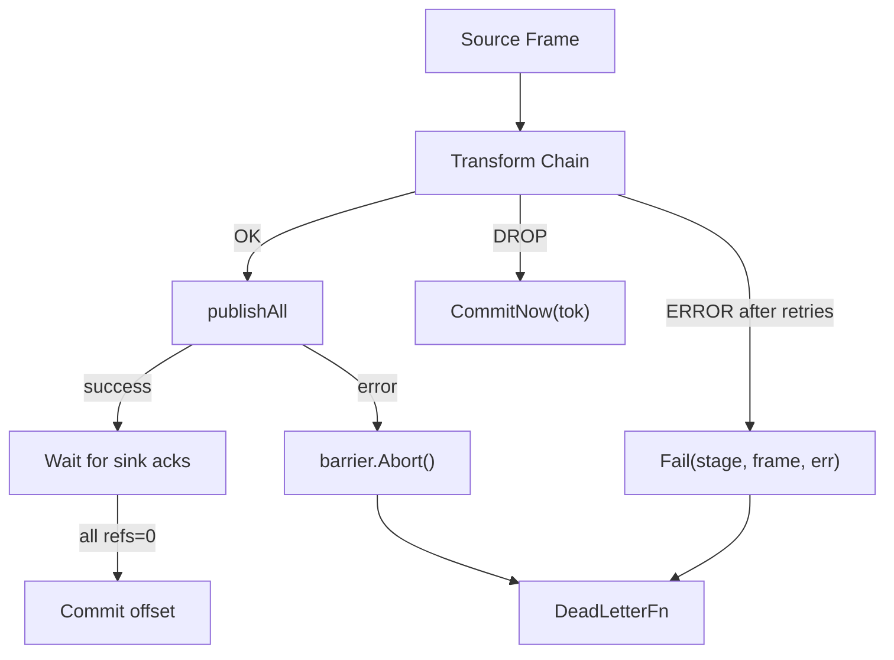

# Error Handling

## Error Classification

| Stage Outcome                     | Commit Offset?        | Retry?                       | Dead-Letter? | Notes                                                                       |
| --------------------------------- | --------------------- | ---------------------------- | ------------ | --------------------------------------------------------------------------- |
| Transform success → All sinks ack | Yes                   | No                           | No           | Barrier refs reach 0 → `Live→Committed`.                                    |
| Transform transient error         | No (pending)          | Yes, bounded by stage config | No           | Retried with backoff. After exhaustion → permanent failure.                 |
| Transform permanent error         | Conditional           | No                           | Yes          | `Fail()` dead-letters. If no frames survive, `CommitNow()` advances offset. |
| Sink publish error                | No                    | No (barrier aborted)         | Yes          | `barrier.Abort()` prevents commit. `Fail()` invokes `DeadLetterFn`.         |
| AckAware sink delivery failure    | Yes (ack still fires) | Broker-level                 | No           | Sarama pump acks on both Successes and Errors — at-least-once semantics.    |
| Transformer `DROP`                | Yes                   | No                           | No           | No derived frames → `CommitNow()`.                                          |
| Context cancelled                 | No                    | No                           | No           | Outstanding barriers abandoned. Shutdown safety.                            |

## Dead-Letter Handler

The `AckCoordinator.Fail(stage, frame, cause)` method invokes the registered `DeadLetterFn`:

```go
type DeadLetterFn func(stage string, frame *pb.Frame, cause error)
```

- Set via `Runner.SetDeadLetter(fn)` → `coord.SetDeadLetter(fn)`
- Called for permanently failed frames after retry exhaustion
- The checkpoint lifecycle is handled by the caller (`pushFrame`): if all derived frames fail, `CommitNow()` advances the offset; if some survive, the surviving barrier commits when sinks ack

## Error Flow



## Hooks

- Stage configuration controls retry count and backoff duration per transformer.
- Sink adapters expose retry/backoff knobs (`retry.*`) in their config.
- Metrics: publish attempts/errors, retry totals, barrier commit/abort counts via `AckCoordinator.Len()` observability.
