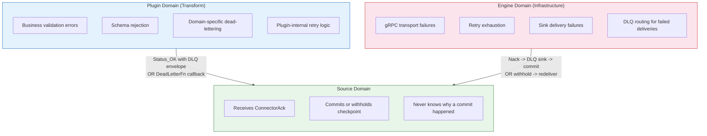
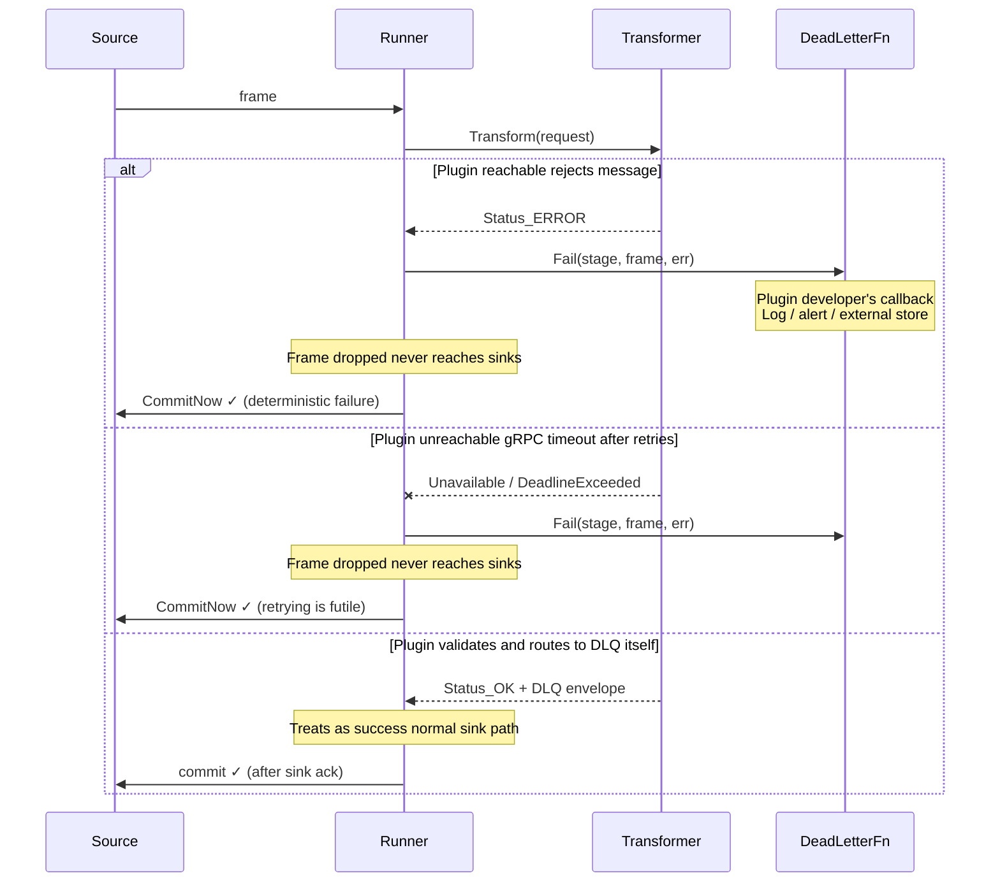
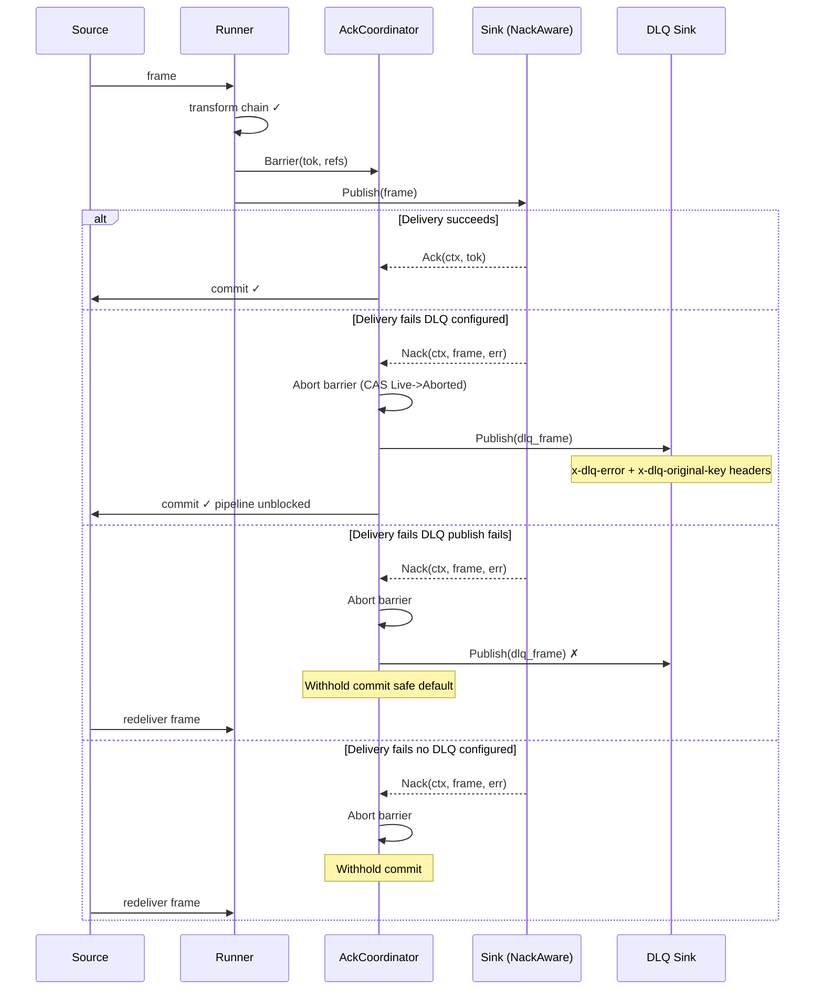
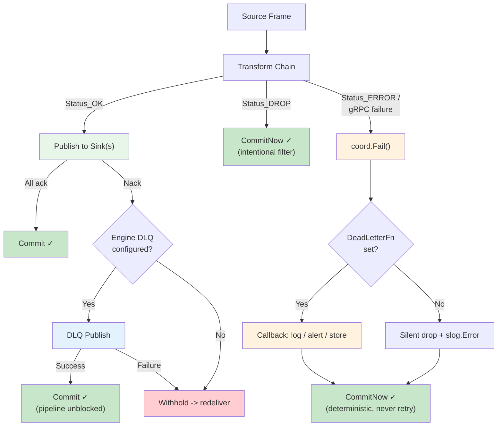

# Error Ownership & DLQ Boundaries

## Principle

Every error in Quanta has exactly one owner. The owner decides the response.
The engine never overrides a plugin's decision; plugins never handle
infrastructure failures.

---

## Ownership Map



---

## Two Error Paths

### Path 1 Transform Errors (Plugin-Owned)

**Owner:** Plugin developer
**Config:** Code-level (`SetDeadLetter(fn)`)
**Interface:** `DeadLetterFn func(stage string, frame *pb.Frame, cause error)`

The plugin has full authority over message validity. When a transform fails,
the engine does not retry to a different sink or route to an engine DLQ.
The message never reaches sinks.



**Why always commit?** Transform failures are deterministic the same message
will fail the same way on redelivery. Withholding would create an infinite
retry loop (poison pill). The plugin had its chance. Advance the source.

**What if `DeadLetterFn` is not set?** The frame is silently dropped and the
source advances. The only trace is `slog.Error`. This is the plugin
developer's responsibility if they care about failed messages, they set the
callback.

---

### Path 2 Sink Errors (Engine-Owned)

**Owner:** Engine operator
**Config:** YAML (`pipeline.yml` -> `dlq:` section)
**Interface:** `NackFn func(ctx context.Context, frame *pb.Frame, err error)`

The frame was valid and transformed successfully. The sink couldn't deliver it.
This is an infrastructure problem the engine owns the response.



**Why conditional commit?** Sink failures are transient the broker might
recover, the network might heal. Redelivery might succeed. The engine only
commits when the DLQ safely captures the frame, preserving at-least-once
delivery.

---

## Boundary Rules

```
┌─────────────────────────────────────────────────────────────────┐
│                        Transform Layer                          │
│                                                                 │
│  Plugin returns Status_OK with DLQ envelope?                    │
│    -> Engine sees SUCCESS. Normal sink path. Plugin's decision.  │
│                                                                 │
│  Plugin returns Status_ERROR / gRPC fails?                      │
│    -> Engine calls Fail(). Frame NEVER reaches sinks.            │
│    -> DeadLetterFn fires if set. Source always advances.         │
│                                                                 │
│  Rule: The engine does not second-guess the plugin.             │
│        If the plugin says ERROR, the message is dead.           │
├─────────────────────────────────────────────────────────────────┤
│                          Sink Layer                             │
│                                                                 │
│  Sink delivers successfully?                                    │
│    -> Ack(ctx, tok). Barrier resolves. Source commits.           │
│                                                                 │
│  Sink fails to deliver?                                         │
│    -> Nack(ctx, frame, err). Barrier aborted.                    │
│    -> DLQ configured? Publish + commit. Not? Withhold.           │
│                                                                 │
│  Rule: The engine owns the DLQ decision for sink failures.      │
│        The sink just reports success or failure.                 │
└─────────────────────────────────────────────────────────────────┘
```

---

## Comparison Table

| Aspect                   | Transform Error Path           | Sink Error Path                 |
| ------------------------ | ------------------------------ | ------------------------------- |
| **Owner**                | Plugin developer               | Engine operator                 |
| **Configuration**        | Code: `SetDeadLetter(fn)`      | YAML: `dlq:` section            |
| **Trigger**              | `Status_ERROR`, gRPC failure   | Sink `Publish()` fails          |
| **Frame reaches sinks?** | Never                          | Yes (already transformed)       |
| **Commit behavior**      | Always advance (deterministic) | Only on DLQ success (transient) |
| **No handler set**       | Silent drop + advance + log    | Withhold + redeliver            |
| **Redelivery useful?**   | No same failure on retry       | Yes infrastructure may recover  |
| **Coordinator method**   | `Fail(stage, frame, cause)`    | `Nack(ctx, frame, cause)`       |

---

## Combined Flow



---

## Design Rationale

1. **Two owners, two mechanisms, zero overlap.** Transform errors and sink
   errors have different root causes, different retry semantics, and different
   audiences. Merging them into one path forces a single commit policy on two
   incompatible failure modes.

2. **Plugin authority is absolute.** If a transform says a message is invalid,
   the engine does not preserve it, retry it, or route it to an engine DLQ.
   The plugin can route to its own DLQ (via `Status_OK` + envelope) if it
   wants the message preserved. This is the plugin's domain decision.

3. **Engine DLQ is for infrastructure, not validation.** The `dlq:` config in
   `pipeline.yml` exists solely for frames that were valid but couldn't be
   delivered. Operators configure it to prevent pipeline stalls on broker
   outages or sink failures. It never captures transform rejections.

4. **Commit semantics follow failure type.** Deterministic failures (transform)
   always commit retrying would produce the same error. Transient failures
   (sink) withhold by default the infrastructure may recover. This prevents
   both infinite retry loops and unnecessary data loss.
