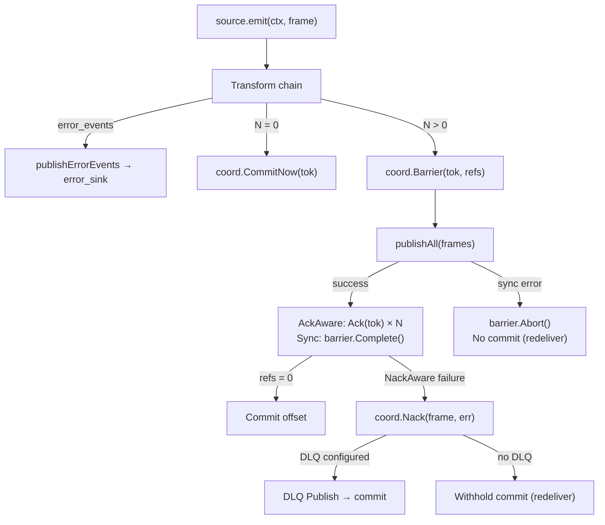

# Pipeline Model

## Transformer Chain

- Transformers are invoked sequentially for each frame.
- Each stage receives the frame context and must return a `pb.TransformResponse`.
- Responses with status `OK` carry zero or more events forward; `DROP` filters the frame; `ERROR`/`RETRY` trigger retry logic according to stage configuration.
- Each transformer may optionally declare an `error_sink` — plugin-rejected `error_events` are routed there by the engine.

## Filter Semantics

- A filter returns `DROP` (or emits no events). The runner calls `coord.CommitNow(tok)` immediately and stops the chain.
- Filters must be side-effect free aside from emitting metrics/logs.

## Runner Flow

1. Source emits `emit(ctx, frame)`.
2. Runner iterates through transformers → produces `N` derived frames (0 if all dropped/failed).
   - If the `TransformResponse` contains `error_events`, the runner calls `publishErrorEvents()` to route them to the transformer's per-stage `error_sink` (if configured; otherwise logged and dropped).
3. If `N = 0`: `coord.CommitNow(tok)` — offset advances immediately.
4. If `N > 0`: Runner creates a **barrier** via `coord.Barrier(tok, refs)` where `refs = N × ackAwareSinks + 1` (sync sinks).
5. `publishAll` sends each derived frame to every sink.
6. **AckAware sinks** (Kafka, S3) call `coord.Ack(ctx, tok)` asynchronously when delivery confirms — each call decrements the barrier's refcount.
7. **NackAware sinks** (Kafka, S3) call `coord.Nack(ctx, frame, err)` on permanent delivery failure — the coordinator aborts the barrier, publishes to the engine DLQ sink (if configured), then commits. If no DLQ is configured, the commit is withheld and the source redelivers.
8. **Synchronous sinks** (stdout) complete inline — Runner calls `barrier.Complete()` after all sync publishes return.
9. When refs reach 0, the barrier CAS transitions `Live → Committed` and the coordinator commits the checkpoint to the source.



## Error Handling — Three Paths

> See [Error Ownership](error-ownership.md) for the definitive reference.

### Path 1: Plugin Error Routing (`error_events` → `error_sink`)

When a transformer rejects a message (bad schema, business rule violation), the plugin returns the rejected events in `TransformResponse.error_events`. The engine routes them to the per-stage `error_sink`. The transform is considered successful — the offset commits.

### Path 2: Engine DLQ (NackAware → `coord.Nack`)

When an `AckAware` + `NackAware` sink permanently fails to deliver a frame (e.g., Kafka broker rejects, S3 upload error), it calls `NackFn(ctx, frame, err)`. The `AckCoordinator` aborts the barrier, publishes the frame to the engine DLQ sink (if configured), and commits the checkpoint. If no DLQ is configured, the coordinator withholds the commit for source redelivery.

### Path 3: Transform Infrastructure Failure (`DeadLetterFn`)

When a transform stage exhausts retries (gRPC timeout, plugin unavailable), the runner calls `coord.Fail(stage, frame, cause)`. The coordinator invokes the `DeadLetterFn` callback (if set). Since the same message will fail the same way on redelivery (poison pill), the offset is committed via `CommitNow`.

## Fan-Out

When a transformer produces multiple output frames from a single input, or when multiple AckAware sinks are configured, the barrier's reference count covers every combination:

```
refs = len(derivedFrames) × ackAwareSinks + (1 if syncSinks > 0 or ackAwareSinks == 0)
```

Each sink independently decrements the barrier. The checkpoint only commits when **every** sink has acknowledged **every** derived frame.

## Retry Policy

- Each stage defines `retry_attempts` and `backoff_ms`. Retries use the same context with timeout wrappers.
- Exhaustion invokes `coord.Fail(stage, frame, cause)` which dead-letters the frame via `DeadLetterFn`. If no derived frames survive, `CommitNow()` advances the offset. If other derived frames are still in flight, the surviving barriers commit independently.

## Observability Hooks

- `AckCoordinator.Len()` reports outstanding unresolved barriers — useful for monitoring pipeline health and backpressure.
- Logging via `internal/logging`. Metrics for publish attempts/errors provided through `internal/telemetry`.
