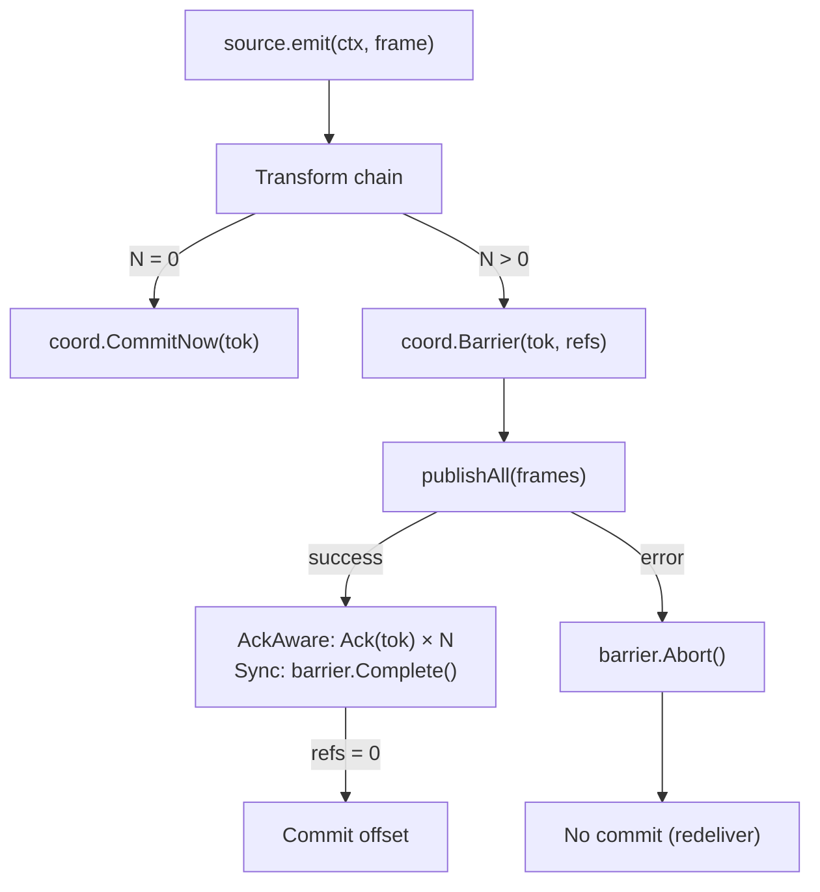

# Pipeline Model

## Transformer Chain

- Transformers are invoked sequentially for each frame.
- Each stage receives the frame context and must return a `pb.TransformResponse`.
- Responses with status `OK` carry zero or more events forward; `DROP` filters the frame; `ERROR`/`RETRY` trigger retry logic according to stage configuration.

## Filter Semantics

- A filter returns `DROP` (or emits no events). The runner calls `coord.CommitNow(tok)` immediately and stops the chain.
- Filters must be side-effect free aside from emitting metrics/logs.

## Runner Flow

1. Source emits `emit(ctx, frame)`.
2. Runner iterates through transformers → produces `N` derived frames (0 if all dropped/failed).
3. If `N = 0`: `coord.CommitNow(tok)` — offset advances immediately.
4. If `N > 0`: Runner creates a **barrier** via `coord.Barrier(tok, refs)` where `refs = N × ackAwareSinks + 1` (sync sinks).
5. `publishAll` sends each derived frame to every sink.
6. **AckAware sinks** (Kafka, S3) call `coord.Ack(tok)` asynchronously when delivery confirms — each call decrements the barrier's refcount.
7. **Synchronous sinks** (stdout) complete inline — Runner calls `barrier.Complete()` after all sync publishes return.
8. When refs reach 0, the barrier CAS transitions `Live → Committed` and the coordinator commits the checkpoint to the source.



## Fan-Out

When a transformer produces multiple output frames from a single input, or when multiple AckAware sinks are configured, the barrier's reference count covers every combination:

```
refs = len(derivedFrames) × ackAwareSinks + (1 if syncSinks > 0 or ackAwareSinks == 0)
```

Each sink independently decrements the barrier. The checkpoint only commits when **every** sink has acknowledged **every** derived frame.

## Retry Policy

- Each stage defines `retry_attempts` and `backoff_ms`. Retries use the same context with timeout wrappers.
- Exhaustion invokes `coord.Fail(stage, frame, cause)` which dead-letters the frame. The checkpoint lifecycle depends on whether other derived frames survive.

## Observability Hooks

- `AckCoordinator.Len()` reports outstanding unresolved barriers — useful for monitoring pipeline health and backpressure.
- Logging via `internal/logging`. Metrics for publish attempts/errors provided through `internal/telemetry`.
