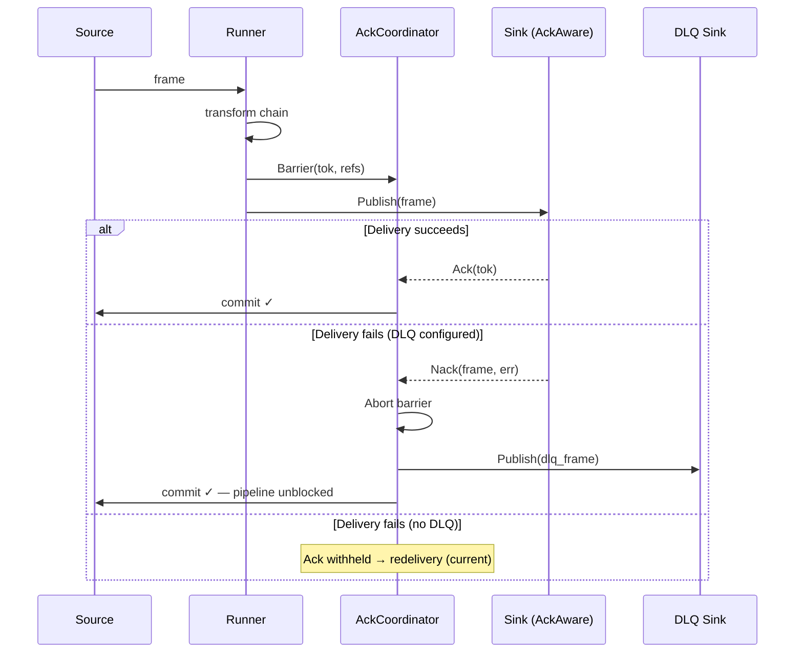

# Epic: Sink Nack & Engine-Managed DLQ

> **Status:** Planned
> **Depends on:** AckCoordinator (PR #15, merged)
> **Branch:** `feat/sink-nack-dlq`

---

## Problem

A single sink delivery failure blocks the entire source partition. The offset
is never committed, so every message behind the failed one stalls. On restart
the whole partition reprocesses through the transform chain — wasting compute
on work that already succeeded.

**Poison pill:** If one message always fails at the sink the pipeline is stuck
forever until an operator intervenes.

This applies regardless of source type — Kafka, SQS, HTTP, or any future
`CheckpointToken` kind. The coordinator only sees `*pb.CheckpointToken`; it
never inspects the oneof. The fix must be source-agnostic.

---

## Goal

When a sink permanently fails to deliver a message:

1. Route the failed frame to a configurable DLQ sink.
2. Commit the source checkpoint so the pipeline keeps flowing.
3. If no DLQ is configured, preserve current behaviour (withhold ack, redeliver).

---

## Pipeline YAML — Target Shape

```yaml
schema_version: v1

source:
  kind: kafka
  driver: sarama
  config: kafka_source.yml

transformers:
  - name: cloudevents
    type: grpc
    address: "cloudevents:50052"
    timeout_ms: 1000
    retry_policy:
      attempts: 3
      backoff_ms: 200

sinks:
  - stdout
  - kafka

# ─── NEW: engine-managed dead-letter queue ───
dlq:
  enabled: true # opt-in, default false
  sink: kafka # any registered sink adapter
  config: # same shape as sink_configs entries
    topic: quanta-dlq
    brokers: [kafka:29092]
  include_original_headers: true
  include_error_metadata: true
```

When `dlq.enabled: false` (or absent), nothing changes — current withhold-ack
behaviour is preserved.

---

## Interfaces

### New: `sink.NackAware`

```go
// NackFn is called when a sink permanently fails to deliver a frame.
type NackFn func(frame *pb.Frame, err error)

// NackAware sinks can signal per-message delivery failure.
type NackAware interface {
    BindNack(NackFn)
}
```

Sinks that don't implement `NackAware` keep current behaviour.

### New: `AckCoordinator.Nack`

```go
func (c *AckCoordinator) Nack(frame *pb.Frame, cause error)
```

1. Abort the barrier (CAS `Live → Aborted`).
2. Publish a DLQ frame to the configured DLQ sink.
3. On DLQ success → `commit(tok)` → source advances.
4. On DLQ failure → log, do NOT commit → redelivery (safe default).

---

## Source-Agnostic Nack Semantics

| Source | Token         | Ack (success)   | Nack (→ DLQ → commit)          |
| ------ | ------------- | --------------- | ------------------------------ |
| Kafka  | `KafkaOffset` | Commit offset   | DLQ → commit offset → advance  |
| SQS    | `SqsHandle`   | Delete message  | DLQ → delete message → advance |
| HTTP   | `HttpAckID`   | Respond 200     | DLQ → respond 200 → advance    |
| Raw    | `bytes`       | Source callback | DLQ → same callback → advance  |

The source receives a `ConnectorAck` in all cases. It never knows whether the
message was processed successfully or DLQ'd.

---

## Three DLQ Layers

```
┌─────────────────────────────────────────────────────────────┐
│  1. Plugin-Owned DLQ (business logic)                       │
│     Transformer returns Status_OK with DLQ envelope.        │
│     Engine sees success → sinks publish → ack → commit.     │
│     The transformer decides what's invalid.                  │
├─────────────────────────────────────────────────────────────┤
│  2. Engine-Owned Nack DLQ (sink delivery failure) ← THIS    │
│     Sink can't deliver → Nack(frame, err) → DLQ sink →      │
│     commit → pipeline keeps flowing.                         │
│     Configurable via pipeline.yml dlq: section.              │
├─────────────────────────────────────────────────────────────┤
│  3. DeadLetterFn (transform infrastructure failure)         │
│     gRPC timeout after retries → Fail() callback.            │
│     No frames survive → CommitNow → advance.                 │
│     Existing mechanism, unchanged.                           │
└─────────────────────────────────────────────────────────────┘
```

---

## Flow



---

## Implementation Plan

### Phase 1 — Config & Coordinator Core

**Files:** `internal/config/pipeline.go`, `internal/pipeline/ack_coordinator.go`,
`sink/registry.go`

| #   | Task                                               | Detail                                                                                                |
| --- | -------------------------------------------------- | ----------------------------------------------------------------------------------------------------- |
| 1.1 | Add `DLQConfig` to `PipelineConfig`                | `dlq:` section with `enabled`, `sink`, `config`, `include_original_headers`, `include_error_metadata` |
| 1.2 | Add `NackFn` and `NackAware` to `sink/registry.go` | Type alias + interface, same pattern as `EmitFn` / `AckAware`                                         |
| 1.3 | Add `Nack()` to `AckCoordinator`                   | Abort barrier → publish to DLQ sink → commit on success                                               |
| 1.4 | Add `SetDLQSink()` to `AckCoordinator`             | Stores `sink.Adapter` under mutex                                                                     |
| 1.5 | Add `buildDLQFrame()` helper                       | Wraps original frame with error metadata, copies headers                                              |
| 1.6 | Add `HasDLQ()` to `AckCoordinator`                 | Returns whether a DLQ sink is configured                                                              |
| 1.7 | Tests                                              | `TestNack_AbortAndDLQ`, `TestNack_NoDLQ_Withholds`, `TestNack_DLQFails_Withholds`                     |

**Gate:** All coordinator nack tests pass with race detector.

### Phase 2 — Pipeline Compiler Wiring

**Files:** `internal/pipeline/compiler.go`, `internal/pipeline/runner.go`

| #   | Task                                 | Detail                                                                       |
| --- | ------------------------------------ | ---------------------------------------------------------------------------- |
| 2.1 | `compileDLQ()` in compiler           | Create, configure, and wire DLQ sink from `dlq:` config                      |
| 2.2 | Bind nack in `Runner.AddSink()`      | If sink implements `NackAware`, call `BindNack(coord.Nack)`                  |
| 2.3 | Update `publishAll()` for sync sinks | If DLQ exists and sync publish fails → `coord.Nack(f, err)` instead of abort |
| 2.4 | Close DLQ sink in `Runner.Close()`   | DLQ sink gets same lifecycle as other sinks                                  |
| 2.5 | Tests                                | `TestCompileDLQ`, `TestPublishAll_SyncNack`, `TestPublishAll_NoDLQ_Aborts`   |

**Gate:** Compiler creates DLQ sink from YAML, runner nacks on sync failures.

### Phase 3 — Kafka Sink NackAware

**Files:** `sink/kafka/driver_sarama.go`, `sink/kafka/driver_sarama_test.go`

| #   | Task                                   | Detail                                                                                  |
| --- | -------------------------------------- | --------------------------------------------------------------------------------------- |
| 3.1 | Change `inflight` to carry `*pb.Frame` | Need full frame for DLQ, not just checkpoint                                            |
| 3.2 | Implement `BindNack` on `SaramaSink`   | Satisfy `NackAware` interface                                                           |
| 3.3 | Update `ackLoop()` error branch         | Call `nackFromMetadata` when nack is bound, fall back to log-only when not              |
| 3.4 | Update `Publish` to store full frame   | `Metadata: &inflight{frame: f}`                                                         |
| 3.5 | Compile-time check                     | `var _ sink.NackAware = (*SaramaSink)(nil)`                                             |
| 3.6 | Tests                                  | `TestAckLoopNacksOnError`, `TestAckLoopNackFallback_NoHandler`, `TestAckLoopDrains_MixedAckNack` |

**Gate:** Kafka ackLoop nacks on broker errors, falls back gracefully without handler.

### Phase 4 — S3 Sink NackAware

**Files:** `sink/s3/driver.go`, `sink/s3/driver_test.go`

| #   | Task                                             | Detail                                                                       |
| --- | ------------------------------------------------ | ---------------------------------------------------------------------------- |
| 4.1 | Implement `BindNack` on S3 `Driver`              | Same pattern as Kafka                                                        |
| 4.2 | Update `uploadBatch` error paths                 | `nackAll(frames, err)` instead of log-only                                   |
| 4.3 | Store `*pb.Frame` in batch (not just checkpoint) | Need full frame for DLQ envelope                                             |
| 4.4 | Compile-time check                               | `var _ sink.NackAware = (*Driver)(nil)`                                      |
| 4.5 | Tests                                            | `TestUploadError_Nack`, `TestEncodeError_Nack`, `TestNackFallback_NoHandler` |

**Gate:** S3 upload/encode failures nack per frame, falls back without handler.

### Phase 5 — E2E Validation

| #   | Task                             | Detail                                                                  |
| --- | -------------------------------- | ----------------------------------------------------------------------- |
| 5.1 | Add `pipeline.docker.dlq.yml`    | Kafka→Kafka with `dlq:` section pointing to `quanta-dlq`                |
| 5.2 | Kafka→Kafka E2E with poison pill | Inject oversized message, verify DLQ receives it, pipeline continues    |
| 5.3 | Kafka→S3 E2E with upload failure | Kill LocalStack mid-batch, verify DLQ receives frames, pipeline resumes |
| 5.4 | No-DLQ E2E                       | Verify current withhold-ack behaviour is unchanged when `dlq:` absent   |
| 5.5 | Update docs                      | `error-handling.md`, `e2e-semantics.md`, `CONFIGS.md`                   |

**Gate:** Zero lag after poison pill with DLQ enabled. DLQ topic has the failed
messages. No-DLQ mode unchanged.

---

## Backward Compatibility

| Scenario                               | Behaviour                                   |
| -------------------------------------- | ------------------------------------------- |
| No `dlq:` in YAML                      | No change. Sinks withhold ack on failure.   |
| `dlq.enabled: false`                   | No change. Explicit opt-out.                |
| Sink doesn't implement `NackAware`     | No change. Ack withheld on failure.         |
| DLQ sink itself fails                  | Offset withheld → redelivery. Safe default. |
| `dlq.enabled: true` + `NackAware` sink | Full nack: DLQ → commit → unblock.          |

---

## Open Decisions

| #   | Question                            | Proposed Answer                                                                                                                |
| --- | ----------------------------------- | ------------------------------------------------------------------------------------------------------------------------------ |
| 1   | Per-sink DLQ or global?             | Global first. Per-sink override if needed later.                                                                               |
| 2   | Sink-internal retries before nack?  | Yes — Sarama `RetryMax`, S3 SDK retries. Engine nack only after sink gives up.                                                 |
| 3   | Naming: `Nack` vs `Reject`?         | `Nack` — shorter, standard messaging terminology.                                                                              |
| 4   | Unify `DeadLetterFn` into DLQ sink? | Keep separate for now. `DeadLetterFn` = transform failures (callback). DLQ sink = sink failures (full lifecycle). Unify later. |
| 5   | DLQ sink type restriction?          | Any `sink.Adapter`. Kafka in prod, stdout in dev, S3 for forensics.                                                            |
| 6   | Max nack retries at engine level?   | Not in v1. Sink retries are sufficient. Add engine-level circuit breaker in v2 if needed.                                      |
