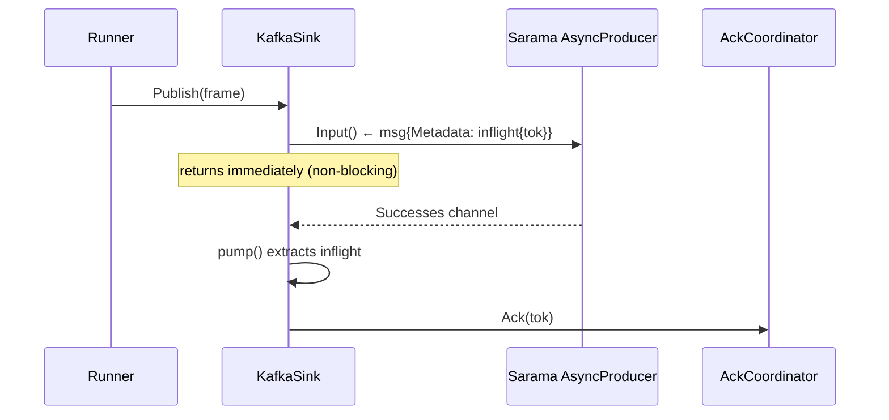

# Sink Specification

Sinks implement:

```go
type Adapter interface {
    Configure(ctx context.Context, cfg any) error
    Publish(ctx context.Context, frame *pb.Frame) error
    Close(ctx context.Context) error
}
```

## AckAware Interface

Sinks that confirm delivery asynchronously implement `AckAware`:

```go
type EmitFn func(*pb.CheckpointToken)

type AckAware interface {
    BindAck(EmitFn)
}
```

During pipeline wiring, `Runner.AddSink` detects `AckAware` sinks and calls `BindAck(coord.Ack)`, binding the sink directly to the `AckCoordinator`. When the sink confirms delivery, it invokes `EmitFn` with the frame's checkpoint token — the coordinator's barrier decrements its refcount and commits when all sinks have acked.

### AckAware vs Synchronous Sinks

| Property            | AckAware Sink                  | Synchronous Sink                               |
| ------------------- | ------------------------------ | ---------------------------------------------- |
| `Publish` behaviour | Non-blocking enqueue           | Blocking write                                 |
| Ack mechanism       | Calls `EmitFn(tok)` on confirm | Runner calls `barrier.Complete()` after return |
| Barrier refs        | `N frames × M ackAware sinks`  | `+1` for all sync sinks combined               |
| Examples            | Kafka, S3                      | Stdout                                         |

## Registration

Drivers register using `sink.Register(sink.Registration{Name: "kafka", New: func() Adapter { ... }, ConfigProto: func() any { return Config{} }})`. The pipeline requests the adapter and hands it a decoded config struct.

## Publish Semantics

- `Publish` must respect cancellation. If the context deadline is exceeded, return `ctx.Err()` and avoid acknowledging the frame.
- The adapter should treat frames as immutable. Any batching must copy payloads/headers.
- **AckAware sinks** attach the checkpoint token to in-flight metadata (e.g., Sarama's `msg.Metadata`) and ack asynchronously when the broker confirms delivery.
- **Synchronous sinks** return from `Publish` once the write is complete; the runner treats the return as implicit acknowledgement.

## Kafka Sink (AckAware)

The Kafka sink uses Sarama's `AsyncProducer`:



- `Publish` attaches `&inflight{checkpoint: frame.Checkpoint}` as `msg.Metadata` and sends to `prod.Input()`.
- `pump()` goroutine reads both `Successes` and `Errors` channels, extracts the `inflight` metadata, and calls `Ack(tok)` on both paths (at-least-once: the message was either delivered or the offset should advance past the error).
- `Close` calls `AsyncClose()` and blocks on `<-doneCh` until `pump()` drains.

## S3 Sink (AckAware)

The S3 sink batches frames and uploads on flush:

- `uploadBatch` collects checkpoint tokens from all frames in the batch.
- On success **or** failure, `ackAll()` calls `EmitFn(tok)` for every token in the batch — ensuring barriers are never left dangling.

## Ordering & Idempotence

- Drivers should maintain per-partition ordering by serialising writes per key.
- Idempotence is achieved via consistent keys and deterministic payloads. Kafka sink uses the frame key directly.

## Shutdown

- `Close` should flush and release resources. It receives the same root context used to start the pipeline.
- AckAware sinks must drain in-flight acknowledgements before returning from `Close`.
